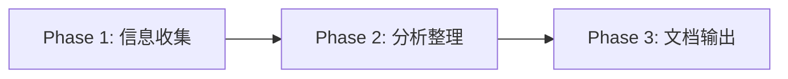

# Claude Token 优化最佳实践 调研计划

> 系统性收集、分析、整理Claude系列工具(Claude Code / API / Web)减少token消耗的最佳实践和方法论。产出可直接用于团队培训的报告。

**目标：** 产出至少5份分类文档 + 1份综合报告 + Mermaid图表 + 安卓转鸿蒙场景应用指南

## 3个阶段

## Sprint 计划

| Sprint | 任务 | 重点 |
|--------|------|------|
| Sprint 1 (即时) | 多维度并行搜索 + 项目初始化 | 10+来源，覆盖面广 |
| Sprint 2 | 去重、分类、深挖 | 结构化分类 |
| Sprint 3 | 文档撰写 + Mermaid图 + git push | 可直接宣讲的完整报告 |

## 搜索维度

1. **Claude Code 官方文档** → /docs CLI参考
2. **社区实践** → Reddit/HN/Discord 讨论
3. **技术博客** → 个人博客/Medium/掘金/知乎
4. **对比研究** → Cursor/Copilot/GitHub Copilot token优化
5. **通用prompt优化** → 学术论文/工业实践
6. **上下文管理** → context window / compaction技术
7. **工具链优化** → .claude.md / CLAUDE.md / ignore / hooks
8. **安卓转鸿蒙场景特化** → 针对迁移项目的token优化
