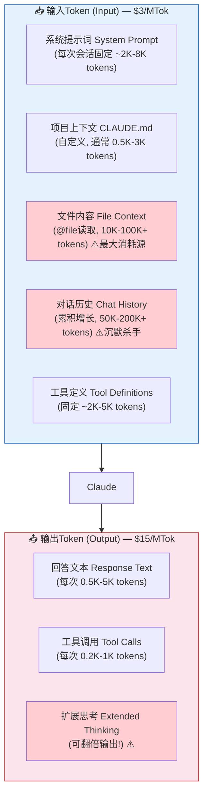
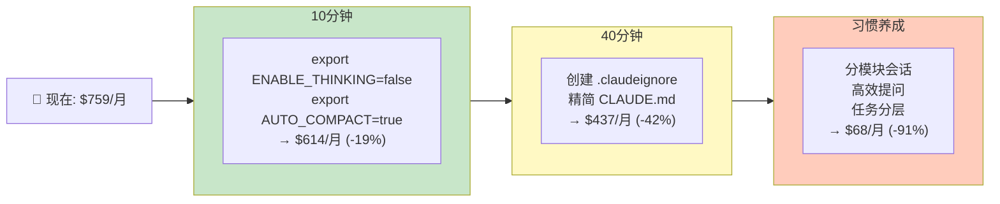
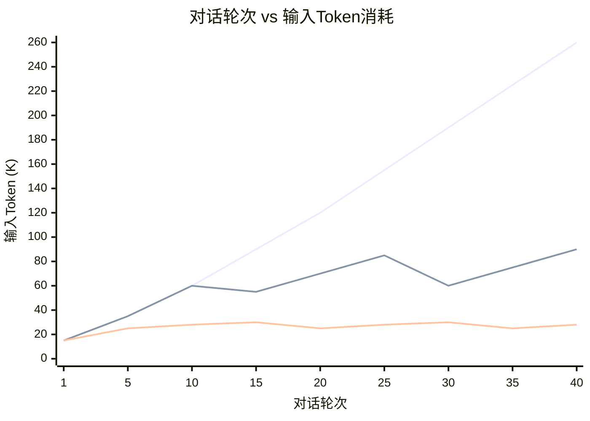
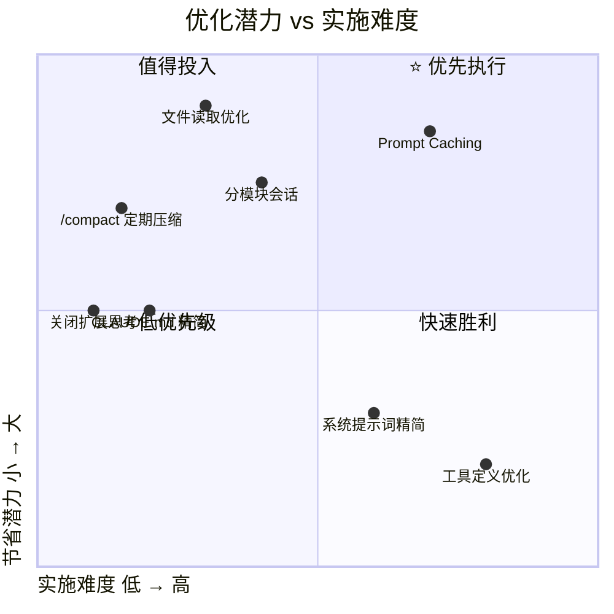
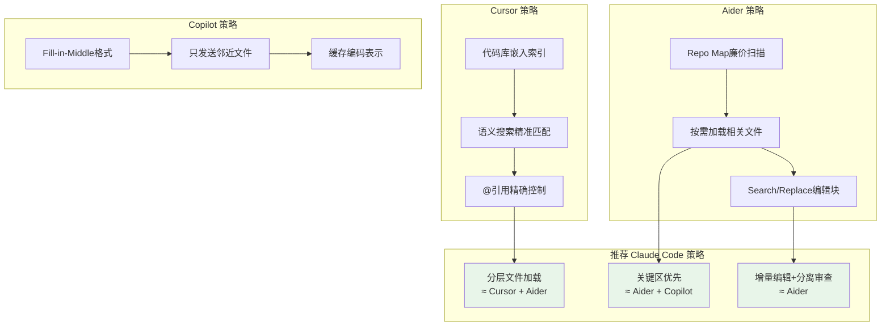
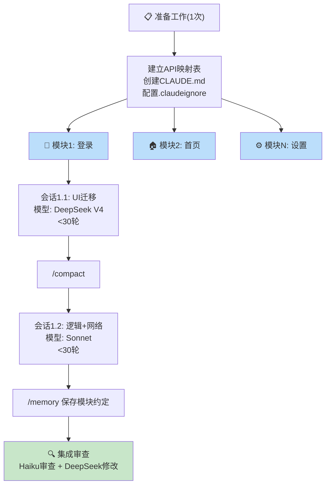
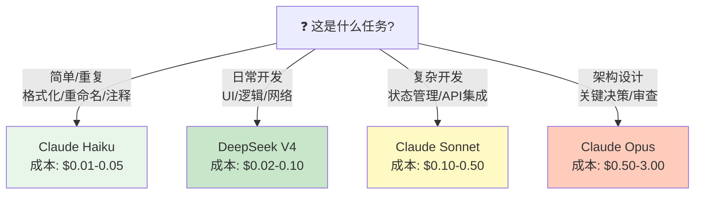
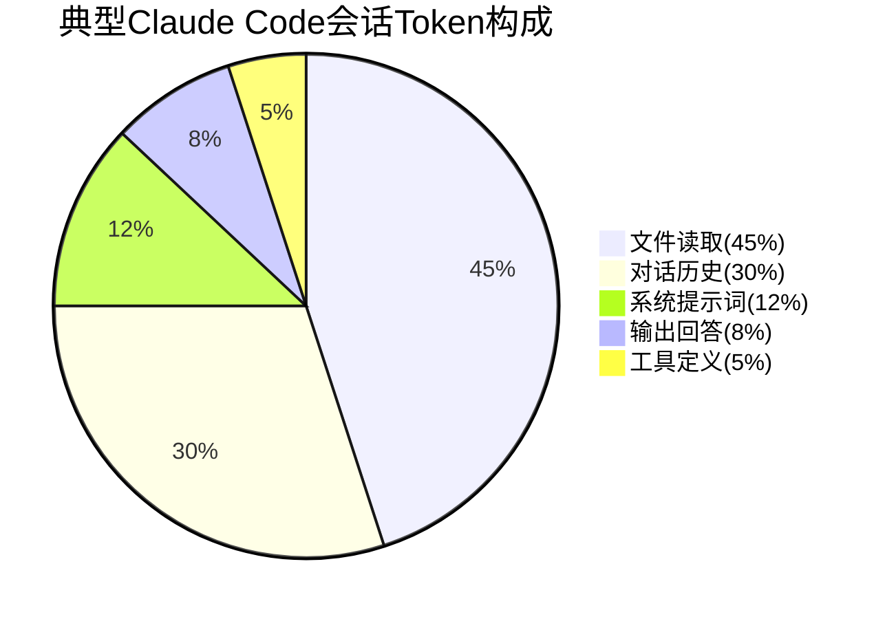

# 图表汇总

> 项目中所有Mermaid图表的集中展示页面，便于宣讲时使用。

---

## 1. Token消耗全景流程

---

## 2. 优化路径图

---

## 3. 对话历史增长曲线

---

## 4. 优化潜力矩阵

---

## 5. 业界工具策略映射

---

## 6. 安卓转鸿蒙工作流

---

## 7. 模型选择决策树

---

## 8. Token消耗构成饼图

