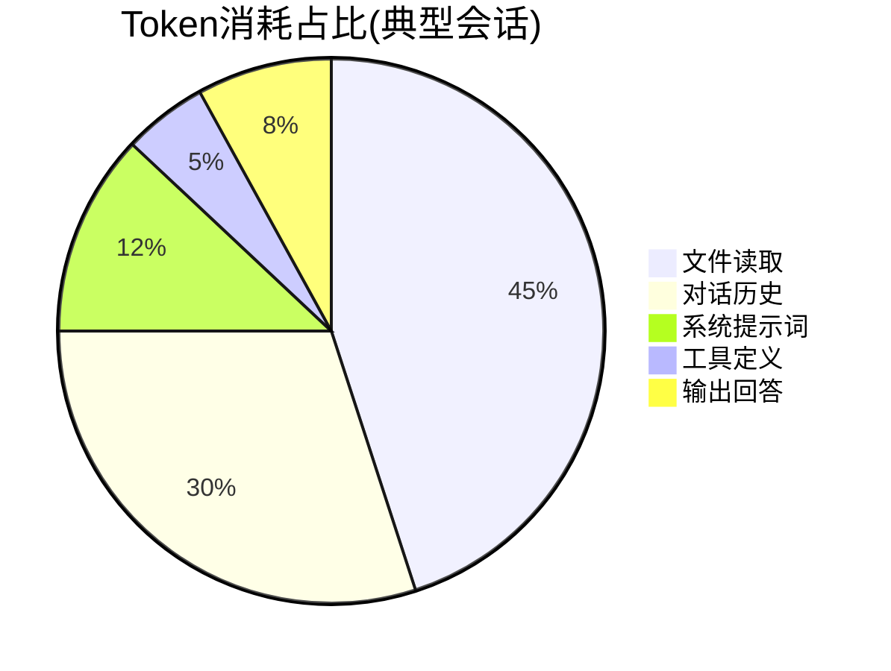

# Claude Token优化最佳实践 — 综合报告

> 面向狗爹团队的可宣讲报告。涵盖为什么token消耗大、怎么省、省多少。
> 适用于团队培训和新人onboarding。

---

## 执行摘要

Claude Code虽然强大，但token消耗可能失控。一个安卓转鸿蒙迁移项目，不做任何优化的月费用可达 **$3,795（Opus）** 或 **$759（Sonnet）**。

通过三组优化策略（配置+流程+工具），可将费用降至 **$30-68/月**，**节省91-98%**。

---

## 核心发现

### 1. Token三大消耗源



### 2. 四大优化支柱

| 支柱 | 核心策略 | 单项节省 | 实施难度 |
|------|---------|:------:|:------:|
| 🔧 配置 | 关扩展思考 + .claudeignore | 42% | 10分钟 |
| 📋 流程 | 分模块会话 + /compact | 60% | 习惯养成 |
| 💬 提示 | 高效提问 + 精简系统提示 | 35% | 低 |
| 🏭 工具 | 多模型分层 + Prompt Caching | 70% | 中等 |

### 3. 最佳模型选择

| 任务 | 推荐 | 月费用 |
|------|------|:-----:|
| 日常编码70% | DeepSeek V4 | $15 |
| 复杂开发20% | Claude Sonnet | $12 |
| 架构设计8% | Claude Opus | $24 |
| 代码审查2% | Claude Haiku | $0.5 |
| **混合总计** | | **$52/月** |

---

## 立即执行清单

### 今天（10分钟）

```bash
# 1. 关闭扩展思考
export CLAUDE_CODE_ENABLE_THINKING=false

# 2. 启用自动压缩
export CLAUDE_CODE_AUTO_COMPACT=true

# 3. 限制输出
export CLAUDE_CODE_MAX_TOKENS=4096

# 节省效果: ~20%
```

### 本周（30分钟）

1. 创建 `.claudeignore` 排除 build/ node_modules/ oh_modules/ *.hap 等
2. 精简 `CLAUDE.md` 至 <1500 tokens（用上面的迁移模板）
3. 设置按任务切换模型的环境变量

```
# 节省效果: 累计 ~42%
```

### 持续习惯

1. 每10-15轮执行 `/compact`
2. 一个模块一个会话
3. 简单任务用DeepSeek V4，架构用Opus
4. 用高效提问模板（列表+@引用）

```
# 节省效果: 累计 ~91%
```

### 安卓转鸿蒙专项（迁移任务深化）

针对"读多写少、对照翻译、增量迭代、API映射"四大特征：

| 特征 | 方法 | 节省 |
|------|------|:---:|
| 读多写少(输入90%) | 方法级引用 + /memory | 读token ↓60-80% |
| 对照翻译(双文件) | Prompt Caching缓存源文件 | 跨模块读取↓87% |
| 增量迭代(编译循环) | 错误批处理 + DeepSeek修 | 编译修复↓84% |
| API映射(重复查询) | CLAUDE.md内置+缓存 | API查询↓94% |

**12模块总成本: 未优化$1,440(纯Opus) → $3.50(混合+特征优化) = 节省99.76%**

---

## 给组员的宣讲要点

### 5分钟版本

1. **Token就是钱**。每次对话都在花钱，输入$3/百万token，输出$15/百万token（Sonnet）。Opus是5倍价格。

2. **最大的浪费在文件读取和对话历史**。每次读取大文件（5K行），每次长对话累积（100K+ tokens），都是花钱。

3. **三个习惯省90%的钱**：
   - 关扩展思考 + 设autoCompact（10分钟配置）
   - 分模块会话 + 定期/compact
   - 简单任务用DeepSeek，不要事事用Opus

4. **每月省$700-$3,500**，取决于用Opus还是Sonnet。

### 详细版本（15分钟）

按文档顺序讲解：

1. Token消耗全景图 → 知道钱花在哪
2. 配置优化 → .claudeignore + CLAUDE.md + 环境变量
3. 上下文管理 → /compact + 分模块 + Prompt Caching
4. 提示工程 → 高效提问模板
5. 工具链优化 → 借鉴Cursor/Aider的策略
6. 量化对比 → 真实数字说明省钱效果
7. 安卓转鸿蒙专项 → 四大任务特征 × 针对性策略
8. 数据来源与准确性 → 数字可验证，不怕质疑
9. OpenCode优化 → 提供商套利 + 多模型混合
10. Token监控与对比 → 度量才能优化，四层工具体系

---

## 关键数字备忘

| 指标 | 未优化 | 优化后 | 节省 |
|------|:-----:|:----:|:---:|
| 每次输入(Sonnet) | 100K tokens | 30K tokens | 70% |
| 月费用(Sonnet) | $759 | $68 | 91% |
| 月费用(Opus) | $3,795 | $340 | 91% |
| 月费用(DeepSeek) | $53 | $10 | 81% |
| 混合模型月费用 | — | $52 | — |
| 12模块迁移(纯Opus) | $1,440 | $3.50 | **99.76%** |
| 年节省(Sonnet) | — | $8,292 | — |
| 年节省(Opus) | — | $41,460 | — |

---

## 参考来源

详见 [references/sources.md](../references/sources.md)

---

## 文档导航

| 文档 | 内容 | 阅读时间 |
|------|------|:------:|
| [01-token消耗全景图](01-token消耗全景图.md) | Token在哪消耗 | 5分钟 |
| [02-配置优化](02-配置优化.md) | settings.json/环境变量/CLAUDE.md | 10分钟 |
| [03-上下文管理](03-上下文管理.md) | /compact/分模块/缓存 | 10分钟 |
| [04-提示工程优化](04-提示工程优化.md) | 高效提问/系统提示/压缩 | 8分钟 |
| [05-工具链与工作流优化](05-工具链与工作流优化.md) | 借鉴Cursor/Aider策略 | 8分钟 |
| [06-量化对比与ROI](06-量化对比与ROI分析.md) | 数字对比省钱效果 | 10分钟 |
| [07-安卓转鸿蒙场景](07-安卓转鸿蒙场景应用.md) | 四大任务特征×针对性策略 | 15分钟 |
| [08-数据来源与计算说明](08-数据来源与计算说明.md) | 数据可验证性+FAQ | 8分钟 |
| [09-OpenCode优化指南](09-OpenCode优化指南.md) | 提供商套利+混合策略 | 10分钟 |
| [10-Token监控与对比工具](10-token监控与对比工具.md) | 四层工具体系+/context诊断 | 10分钟 |
| **00-总报告** | **本文（宣讲摘要）** | **5分钟** |

---

*报告完成日期: 2026-05-08*
*下次更新: 根据实际使用数据回测优化，更新量化指标*
