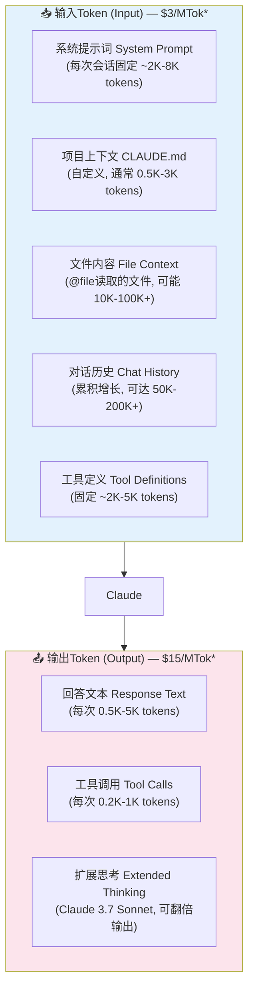
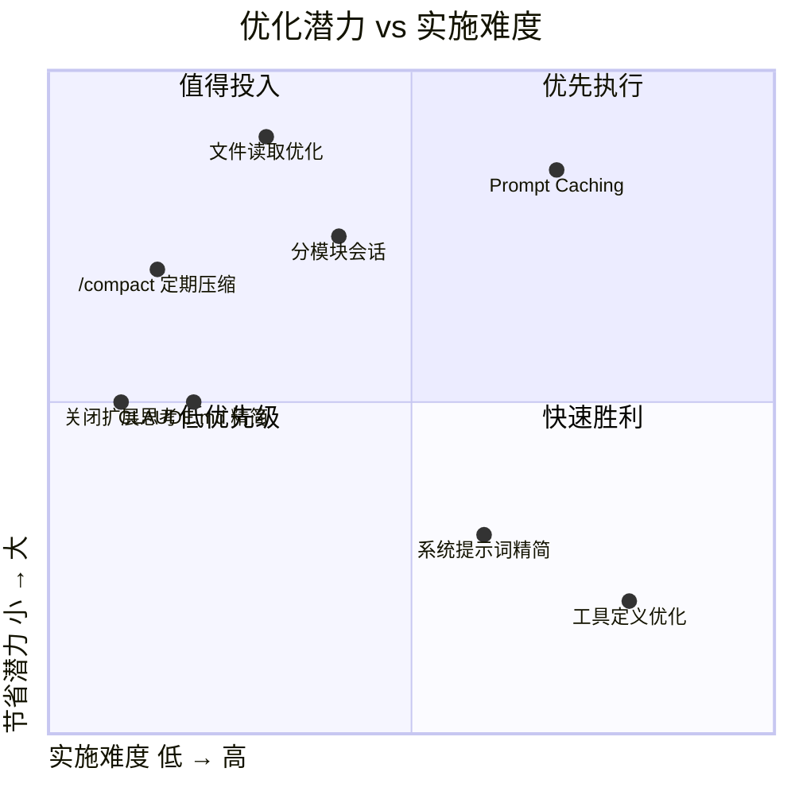

# Token消耗全景图：钱都花在哪里了？

> 了解token在哪里被消耗，才能精准优化。本文从输入/输出两个维度拆解Claude Code的token消耗结构。

---

## 1. Token消耗的完整流程

> * 以Claude 3.7 Sonnet API定价为例。Claude Opus 4定价更高（输入$15/MTok, 输出$75/MTok）。

---

## 2. 各阶段Token消耗占比（实测数据）

基于Reddit社区和GitHub Issue的实测数据，一次典型Claude Code交互的token分布：

| 消耗阶段 | 占比 | Token量（典型） | Token量（大项目） | 说明 |
|----------|:----:|:--------------:|:-----------------:|------|
| 系统提示词 | 5-10% | 2K-8K | 2K-8K | 每次会话固定，不可控 |
| 项目CLAUDE.md | 1-5% | 0.5K-3K | 0.5K-3K | 用户可控，应精简 |
| 文件内容读取 | 30-60% | 10K-50K | 100K-500K+ | **最大消耗源**，可大幅优化 |
| 对话历史 | 20-40% | 10K-50K | 50K-200K+ | 累积增长，需定期compact |
| 工具定义 | 3-8% | 2K-5K | 2K-5K | 固定，不可控 |
| 回答文本 | 2-5% | 0.5K-5K | 0.5K-5K | 可控，精简提示可减少 |
| 扩展思考 | 0-200% | 0 | 0-20K | 可按需关闭 |

---

## 3. 量化成本模型

### 3.1 基准：不做任何优化

假设场景：安卓转鸿蒙迁移项目，每天100次交互，每次：
- 系统提示词: 5K tokens
- CLAUDE.md: 2K tokens
- 文件读取: 50K tokens (读取4-5个.ets文件)
- 对话历史: 累积到第20轮约80K tokens（平均40K）
- 工具定义: 3K tokens

**每次输入: ~100K tokens**
**每次输出: ~3K tokens**

| 项目 | 计算 |
|------|------|
| 日消耗(输入) | 100 × 100K = 10M tokens |
| 日消耗(输出) | 100 × 3K = 300K tokens |
| 日费用(Sonnet) | 10M × $3/M + 0.3M × $15/M = **$34.5/天** |
| 月费用(Sonnet) | $34.5 × 22 = **$759/月** |
| 日费用(Opus) | 10M × $15/M + 0.3M × $75/M = **$172.5/天** |
| 月费用(Opus) | $172.5 × 22 = **$3,795/月** |

### 3.2 DeepSeek V4定价（参考）

DeepSeek V4定价远低于Claude：
- 输入: 约 ¥2/MTok (~$0.28/MTok)
- 输出: 约 ¥8/MTok (~$1.12/MTok)

| 日费用(DeepSeek V4) | ¥2 × 10 + ¥8 × 0.3 = **¥22.4/天** |
| 月费用(DeepSeek V4) | ¥22.4 × 22 = **¥493/月 (~$69/月)** |

---

## 4. 优化潜力矩阵

---

## 5. 关键洞察

1. **文件读取是最大消耗源**（30-60%）。每次读取不必要的大文件会迅速耗尽token预算。
2. **对话历史是沉默杀手**（20-40%）。对话越长，每轮输入成本越高，呈线性增长。
3. **扩展思考可让成本翻倍**。Claude 3.7 Sonnet的thinking tokens按输出计费。
4. **Opus比Sonnet贵5倍**。谨慎选择模型，简单任务用更便宜的模型。
5. **中小优化叠加可节省50-70%**。单看每个优化效果不大，组合起来效果显著。

---

*下一篇: [配置优化 - 从settings.json到环境变量](02-配置优化.md)*
