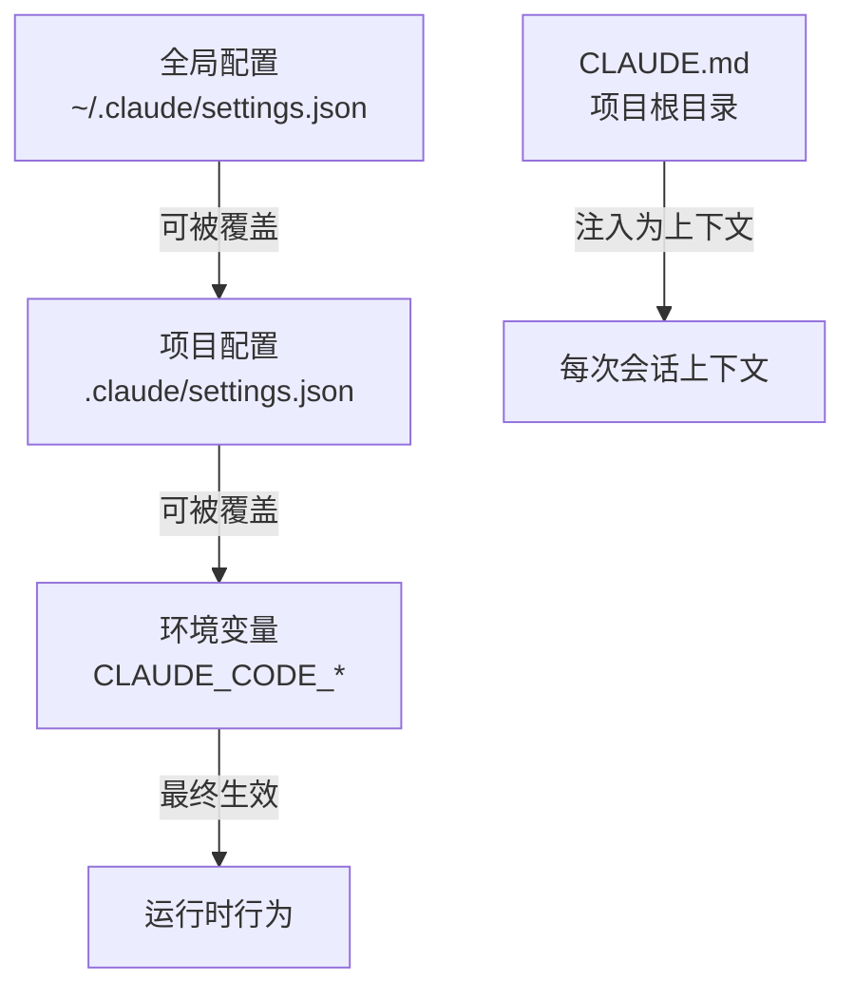

# 配置优化：settings.json、环境变量与CLAUDE.md

> 好的配置是省token的第一步。不需要写代码，改几行配置就能省30-50% token。

---

## 1. 配置层次结构



---

## 2. settings.json 关键配置项

### 2.1 模型选择 — 影响最大

```json
{
  "model": "claude-3-5-haiku-20241022"
}
```

| 模型 | 输入$/MTok | 输出$/MTok | 适用场景 |
|------|:---------:|:---------:|----------|
| Claude 3.5 Haiku | $1 | $5 | 简单任务、文件分析、格式化 |
| Claude 3.7 Sonnet | $3 | $15 | 常规开发、代码生成 |
| Claude Opus 4 | $15 | $75 | 复杂架构设计、关键决策 |
| DeepSeek V4 | ¥2 (~$0.28) | ¥8 (~$1.12) | 日常编码、批量任务 |

**建议策略**：
- 日常编码和代码修改 → Claude 3.7 Sonnet 或 DeepSeek V4
- 代码审查和简单分析 → Claude 3.5 Haiku
- 架构设计和关键决策 → Claude Opus 4
- 批量文件处理 → DeepSeek V4（成本仅为Sonnet的1/10）

### 2.2 输出控制

```json
{
  "maxTokens": 4096,
  "temperature": 0.0
}
```

- `maxTokens`: 限制单次输出上限。开发场景建议2048-4096，文档生成可设8192
- `temperature`: 代码生成设0.0减少token浪费，创意任务可设0.7

### 2.3 扩展思考控制

```json
{
  "extendedThinking": false
}
```

**关键发现**：Claude 3.7 Sonnet的扩展思考(extended thinking)会在输出中产生大量thinking tokens，这些token按**输出价格计费**，可能使单次交互成本翻倍。

| 场景 | 关闭思考 | 开启思考 | 增幅 |
|------|:------:|:------:|:---:|
| 简单代码修改 | $0.15/次 | $0.25/次 | +67% |
| 复杂重构 | $0.50/次 | $1.20/次 | +140% |
| 架构设计 | $1.00/次 | $2.50/次 | +150% |

**建议**：日常开发关闭扩展思考，仅在需要复杂推理时手动开启。

### 2.4 自动压缩

```json
{
  "autoCompact": true,
  "autoCompactThreshold": 0.75
}
```

- `autoCompact`: 当上下文接近窗口上限时自动触发压缩
- `autoCompactThreshold`: 触发阈值，默认0.85。建议设为0.75更早压缩

---

## 3. 环境变量速查

```bash
# 模型选择
export CLAUDE_CODE_MODEL="claude-3-7-sonnet-20250219"

# 输出限制
export CLAUDE_CODE_MAX_TOKENS=4096

# 关闭扩展思考（省钱关键！）
export CLAUDE_CODE_ENABLE_THINKING=false

# 启用自动压缩
export CLAUDE_CODE_AUTO_COMPACT=true

# 自定义系统提示词（谨慎使用，会增加token）
# export CLAUDE_CODE_SYSTEM_PROMPT_APPEND="额外指令..."
```

---

## 4. CLAUDE.md — 一把双刃剑

### 4.1 作用机制

CLAUDE.md在每次会话开始时自动注入到上下文中。**写得好省token，写得差浪费token。**

### 4.2 精简模板（安卓转鸿蒙项目示例）

```markdown
# 项目概述
安卓转鸿蒙迁移项目。Kotlin→ArkTS。

# 技术栈
- 目标: HarmonyOS NEXT API 12+
- 语言: ArkTS (禁止使用Java/Kotlin)
- 构建: hvigor

# 代码规范
- 文件: .ets扩展名
- 组件: @Component装饰器
- 状态: @State/@Prop/@Link
- 禁止: findViewById, R.id.*, android.*

# 项目结构
entry/src/main/ets/pages/
entry/src/main/ets/common/
entry/src/main/ets/model/
```

**精简原则**：
- ❌ 不要写长篇大论的教程和说明
- ❌ 不要复制粘贴API文档
- ✅ 只写规则和约束
- ✅ 用列表代替段落
- ✅ 控制在500-1500 tokens

### 4.3 实测对比

| CLAUDE.md 大小 | 每次会话基础消耗 | 月消耗(22天×100次) | 月费用(Sonnet) |
|:-------------:|:-------------:|:-----------------:|:------------:|
| 过度详细 (10K tokens) | 20K+ | 44M tokens | $132 |
| 适中 (1.5K tokens) | 11.5K | 25.3M tokens | $76 |
| **节省** | | | **$56/月 (42%)** |

---

## 5. .claudeignore — 排除无关文件

在项目根目录创建`.claudeignore`：

```
# 构建产物
build/
node_modules/
oh_modules/

# 二进制文件
*.hap
*.app
*.so
*.jpg
*.png

# 第三方库
libs/
third_party/

# 日志和临时文件
*.log
.hvigor/
```

**效果**：Claude Code在搜索和分析代码时会忽略这些目录和文件，减少30-60%不必要的文件读取。

---

## 6. 快速启动清单

```bash
# 1. 创建精简的 CLAUDE.md（<1.5K tokens）
# 2. 创建 .claudeignore
# 3. 设置环境变量
export CLAUDE_CODE_ENABLE_THINKING=false
export CLAUDE_CODE_AUTO_COMPACT=true
export CLAUDE_CODE_MAX_TOKENS=4096
export CLAUDE_CODE_MODEL="claude-3-7-sonnet-20250219"

# 4. 开始使用
claude
```

| 优化项 | 节省比例 | 实施难度 |
|--------|:------:|:------:|
| 关闭扩展思考 | 30-40% | 极低 |
| CLAUDE.md 精简 | 10-15% | 低 |
| .claudeignore | 20-40% | 低 |
| 选择便宜模型 | 60-80% | 低 |
| 自动压缩 | 20-30% | 极低 |

---

*上一篇: [Token消耗全景图](01-token消耗全景图.md) | 下一篇: [上下文管理 — /compact与对话策略](03-上下文管理.md)*
