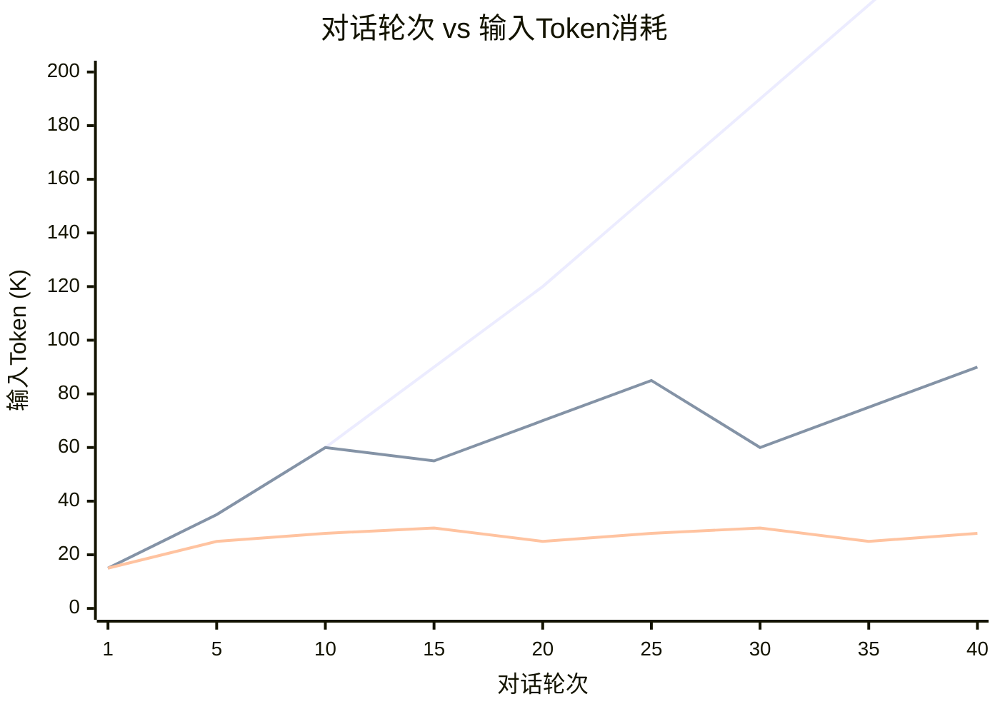
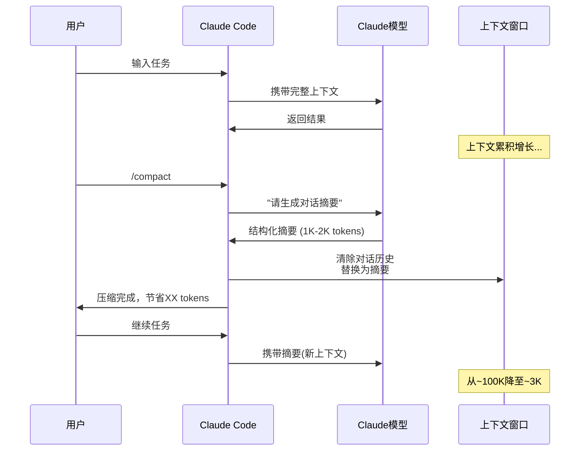
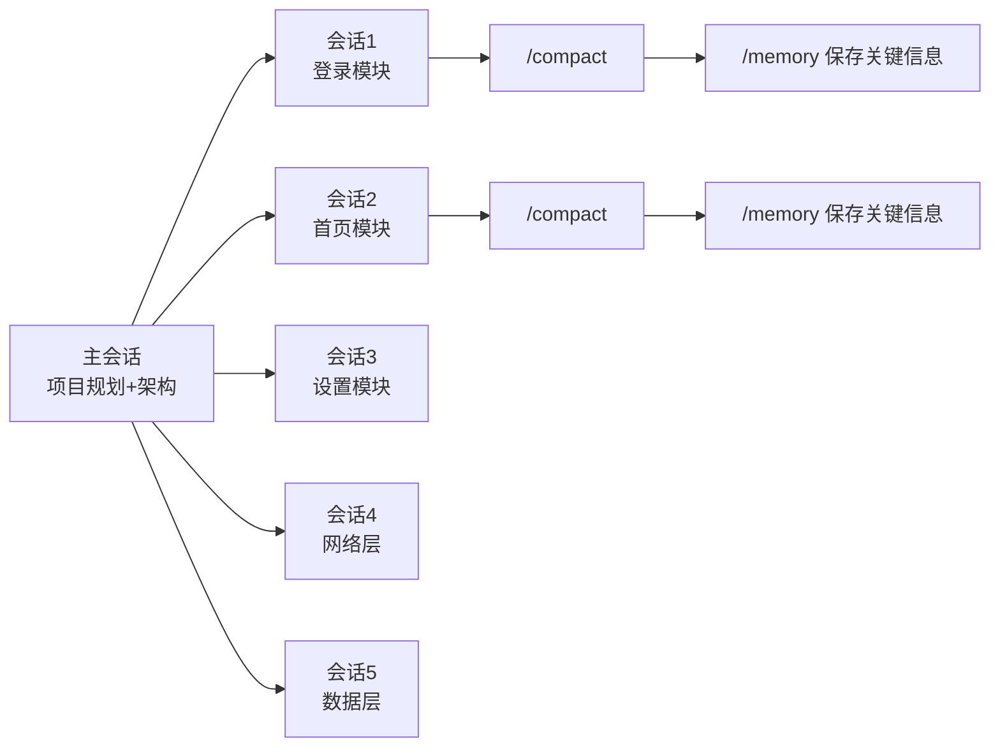

# 上下文管理：/compact、对话策略与缓存

> 对话历史是token消耗的"沉默杀手"——每次新消息都要携带全部历史。掌握上下文管理技术，可节省40-60%的对话成本。

---

## 1. 对话历史的Token增长曲线



**关键数据**：
- 不做压缩：40轮后每次输入260K tokens（成本$0.78/轮）
- 每10轮压缩：40轮后每次输入90K tokens（成本$0.27/轮）→ **节省65%**
- 每5轮压缩：40轮后每次输入28K tokens（成本$0.08/轮）→ **节省90%**

---

## 2. /compact 命令详解

### 2.1 工作原理



### 2.2 压缩效果实测

基于社区数据和GitHub Issue #1567：

| 压缩前对话轮次 | 压缩前token | 压缩后token | 压缩率 | 信息保留 |
|:-----------:|:---------:|:---------:|:-----:|:-----:|
| 10轮 | ~60K | ~1.5K | 97.5% | 95%+ |
| 20轮 | ~180K | ~2K | 98.9% | 90%+ |
| 30轮 | ~350K | ~2.5K | 99.3% | 85%+ |
| 50轮 | ~800K | ~3K | 99.6% | 75%+ |

**权衡**：压缩率越高，细节丢失越多。建议每10-15轮压缩一次，保持较好的信息保留率。

### 2.3 压缩后摘要示例

```markdown
## 对话摘要 (2026-05-08)

### 项目背景
- Android→HarmonyOS迁移，Kotlin→ArkTS
- 当前模块: 登录页面 LoginActivity → LoginPage.ets

### 已完成
- LoginPage UI 布局完成
- 用户名/密码输入框 + 验证逻辑
- 网络请求封装

### 当前状态
- 正在实现Token存储和自动登录
- 需要对接鸿蒙Preferences API

### 关键文件
- entry/src/main/ets/pages/LoginPage.ets
- entry/src/main/ets/common/NetworkClient.ets

### 用户偏好
- 不使用三方库
- 组件命名遵循鸿蒙规范
- 错误处理要有中文提示
```

---

## 3. 分模块会话策略

### 3.1 为什么需要分模块

安卓转鸿蒙项目通常涉及：
- 12+个Activity/Fragment → 12+个Page
- 数据层、网络层、工具类
- 总计可能需要500-1000+轮对话

**在一个长会话中完成所有模块** → 后期每轮输入token爆炸

### 3.2 推荐策略



**操作步骤**：

1. **主会话**：定义项目架构、代码规范、模块划分 → `/memory` 保存全局信息
2. **模块会话**：每次只处理一个模块 → 完成后 `/compact` → `/memory` 保存模块约定
3. **集成会话**：基于memory中的信息进行集成

### 3.3 量化收益

| 策略 | 单模块平均token | 12个模块总计 | vs 单会话 |
|------|:-------------:|:----------:|:-------:|
| 一个长会话（不做compact） | ~500K/模块 | 6M+ | - |
| 一个长会话（每15轮compact） | ~200K/模块 | 2.4M | -60% |
| 分模块会话 | ~80K/模块 | 960K | **-84%** |
| 分模块 + compact + memory | ~50K/模块 | 600K | **-90%** |

---

## 4. Prompt Caching（API层面）

### 4.1 原理

Claude API支持Prompt Caching，缓存命中时输入token价格**降低90%**。

```python
import anthropic

client = anthropic.Anthropic()

response = client.messages.create(
    model="claude-3-7-sonnet-20250219",
    max_tokens=1024,
    system=[
        {
            "type": "text",
            "text": "你是Android→鸿蒙迁移专家...（系统提示词）",
            "cache_control": {"type": "ephemeral"}  # ← 标记缓存
        }
    ],
    messages=[{"role": "user", "content": "迁移LoginActivity到ArkTS"}]
)
```

### 4.2 缓存条件

| 条件 | 说明 |
|------|------|
| 最小块大小 | Claude 3.5 Sonnet/Opus: 1024 tokens, Claude 3 Haiku: 2048 tokens |
| 缓存位置 | 系统提示词、工具定义、消息中的内容块 |
| TTL | 5分钟不活动后过期，每次命中重置 |
| 缓存写入 | 价格高于标准输入（约+25%） |
| 缓存读取 | 价格为标准输入的**10%**（节省90%） |

### 4.3 适用场景

| 场景 | 缓存效果 | 节省 |
|------|:------:|:---:|
| 系统提示词不变，多轮对话 | 极高 | 70-85% |
| 工具定义固定 | 高 | 30-50% |
| 共享代码上下文 | 中等 | 20-40% |

---

## 5. 上下文管理最佳实践总结

| 技术 | 节省效果 | 实施难度 | 优先级 |
|------|:------:|:------:|:-----:|
| 定期 /compact (每10-15轮) | 60-80% | 极低 | ⭐⭐⭐⭐⭐ |
| 分模块会话 | 80-90% | 低 | ⭐⭐⭐⭐⭐ |
| 使用 /memory 跨会话 | 20-30% | 低 | ⭐⭐⭐⭐ |
| 启用 auto-compact | 40-60% | 极低 | ⭐⭐⭐⭐ |
| Prompt Caching (API) | 70-85% | 中 | ⭐⭐⭐ |
| 限制单次文件读取量 | 30-50% | 低 | ⭐⭐⭐⭐⭐ |
| token-efficient-tools header | 50-70%工具输出 | 低 | ⭐⭐⭐⭐ |
| Projects 文件缓存 | 80-95%文件重传 | 低 | ⭐⭐⭐⭐ |

---

## 6. 补充技巧

### 6.1 token-efficient-tools Beta Header

**来源**: CSDN + Anthropic 官方

调用工具时添加 beta header，减少工具调用的输出Token：

```python
# API 请求时添加 header
headers = {
    "anthropic-beta": "token-efficient-tools-2025-02-19"
}
```

**效果**: 减少 **70%** 的工具调用输出Token。对频繁使用工具的场景（如代码搜索、文件操作）效果显著。

### 6.2 Projects 项目功能 — 文件一次上传永久复用

**来源**: 腾讯云社区

Claude 的 Projects 功能相当于项目级文件缓存：
- 把常用文件一次性上传到项目缓存
- 之后所有新对话直接调用，无需重复上传
- 100页文档传一次花几千Token，传20次花几万 → Projects只花一次

**与 Prompt Caching 的区别**: Projects 是Web/Desktop界面的文件管理，Prompt Caching 是API级别的缓存。效果类似，适用场景不同。

---

*上一篇: [配置优化](02-配置优化.md) | 下一篇: [提示工程优化](04-提示工程优化.md)*
