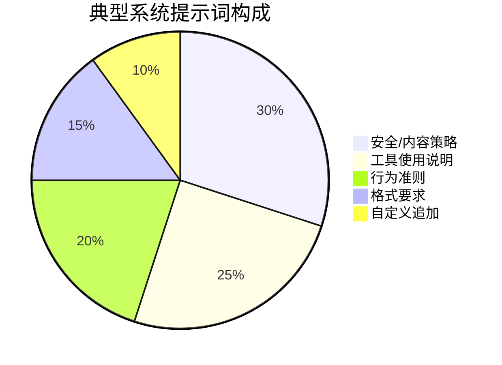

# 提示工程优化：系统提示词、Prompt压缩与高效提问

> 同样的任务，不同的问法，token消耗可以差10倍。掌握提示工程技巧，让每一token都花在刀刃上。

---

## 1. 系统提示词优化

### 1.1 系统提示词的Token消耗

Claude Code在每次会话开始时注入系统提示词。Anthropic默认系统提示词约3K-5K tokens。如果使用`CLAUDE_CODE_SYSTEM_PROMPT_APPEND`追加，还会额外增加。



### 1.2 精简前后对比

| 系统提示词版本 | Token数 | 说明 |
|:-----------:|:-----:|------|
| 默认全文 | ~5,000 | Anthropic默认，包含详细的安全准则 |
| 精简版 | ~2,500 | 删减冗余措辞，保留核心指令 |
| 极简版 | ~1,000 | 仅保留必要的工具说明和行为约束 |
| 自定义最佳 | ~1,500 | 针对安卓转鸿蒙场景定制 |

**节省效果**：系统提示词从5K精简到1.5K，每次会话节省3.5K tokens。100次/天 × 22天 = **节省7.7M tokens/月（$23/月 Sonnet）**

> ⚠️ **警告**：过度精简系统提示词可能导致Claude行为异常（不遵守格式、跳过安全检查）。建议在官方默认基础上做删减，不要从零开始。

---

## 2. 高效提问技巧

### 2.1 提问方式的Token对比

#### ❌ 低效提问（~150 tokens）

```
我需要把一个Android的登录页面迁移到鸿蒙。这个登录页面大概有用户名输入框、
密码输入框、登录按钮、忘记密码链接。还有一些表单验证逻辑，比如用户名不能
为空、密码不能少于6位。还要处理网络请求的loading状态，登录成功后的跳转，
登录失败的错误提示。你能帮我写一下吗？可以参考Android原版的LoginActivity
来迁移，要注意鸿蒙的API差异...
```

#### ✅ 高效提问（~40 tokens）

```
迁移 LoginActivity → LoginPage.ets
- 用户名/密码输入 + 登录按钮
- 验证: 非空 + 密码≥6位
- 网络状态 + 成功跳转 + 错误提示
参考: @LoginActivity.kt
```

**节省**: 150 → 40 tokens（**73%减少**），且指令更清晰。

### 2.2 高效提问原则

| 原则 | 示例 | 节省 |
|------|------|:---:|
| 用列表代替段落 | `- 功能1` 代替 "首先要实现功能1..." | 40-60% |
| 用@引用代替描述 | `@LoginActivity.kt` 代替 "参考LoginActivity里的..." | 50-70% |
| 用关键词代替完整句子 | `迁移` 代替 "请帮我把这个文件迁移到..." | 60-80% |
| 一次性列出所有需求 | 合并多个请求到一个列表 | 30-50% |
| 用模板代替自由格式 | 固定格式请求 | 20-30% |

### 2.3 安卓转鸿蒙提问模板

```markdown
迁移任务: [源文件名] → [目标文件名]
功能: 
- [功能1]
- [功能2]
状态:
- [状态管理说明]
集成:
- [外部依赖说明]
规范:
- [特殊约束]
参考: @[源文件路径]
```

---

## 3. 角色设定优化

### 3.1 冗长 vs 精简

| 方式 | Token | 效果 |
|------|:----:|------|
| ❌ "你是一名资深的Android和鸿蒙开发工程师，拥有10年以上移动开发经验，熟悉..." | ~80 | 效果类似 |
| ✅ "角色: Android→鸿蒙迁移专家" | ~8 | 同样有效 |

**结论**：Claude不需要长篇角色扮演。简短的角色标签+具体指令比详细的角色描述更高效。

---

## 4. Prompt Compression（学术前沿）

### 4.1 LLMLingua

微软提出的压缩技术，用小模型预处理提示词：

```
原始提示: "请帮我分析这个Android项目的架构，包括所有的Activity、Service、
BroadcastReceiver、ContentProvider组件，以及它们之间的交互关系..."

LLMLingua压缩后 (2x): "分析Android项目架构，所有组件和交互关系..."
LLMLingua压缩后 (5x): "分析Android项目架构"
```

| 压缩比 | Token节省 | 性能损失 |
|:-----:|:-------:|:------:|
| 2x | 50% | <1% |
| 5x | 80% | 2-5% |
| 10x | 90% | 5-10% |

### 4.2 Selective Context

基于自信息（self-information）的压缩，去除低信息量词汇：

- 不需要微调模型
- 压缩至原始长度的30-50%
- 适用于长对话历史的压缩

> **注意**：这些技术目前主要在API层面使用。Claude Code CLI暂未内置这些压缩技术。可以自行在发送请求前对提示词做预处理。

---

## 5. 输出格式控制

### 5.1 减少不必要输出

```markdown
# 明确输出要求
- 只输出代码，不要解释
- 用diff格式展示修改
- 不要生成完整文件，只给修改部分
```

| 策略 | 输出Token节省 | 
|------|:-----------:|
| "只输出代码" | 50-70% |
| "用search/replace格式" | 60-80% |
| "不要解释，直接改" | 40-60% |

### 5.2 输出量对比

| 场景 | 自由输出 | 限制后的输出 | 节省 |
|------|:------:|:---------:|:---:|
| 修复一个bug | ~2K tokens | ~500 tokens | 75% |
| 添加新功能 | ~5K tokens | ~1.5K tokens | 70% |
| 代码审查 | ~3K tokens | ~800 tokens | 73% |

**经济效益**：输出token价格是输入的**5倍**（Sonnet: $15 vs $3/MTok）。减少输出 = 5倍省钱。

---

## 6. 提示工程优化汇总

| 技术 | 输入节省 | 输出节省 | 综合节省 | 难度 |
|------|:------:|:------:|:------:|:---:|
| 精简系统提示词 | 10-20% | - | 8-15% | 中 |
| 高效提问模板 | 40-60% | 20-30% | 35-50% | 低 |
| 角色标签化 | 5-10% | - | 3-8% | 极低 |
| 限制输出格式 | - | 50-70% | 10-20% | 极低 |
| LLMLingua压缩 | 50-90% | - | 40-70% | 高 |

---

*上一篇: [上下文管理](03-上下文管理.md) | 下一篇: [工具链与工作流优化](05-工具链与工作流优化.md)*
