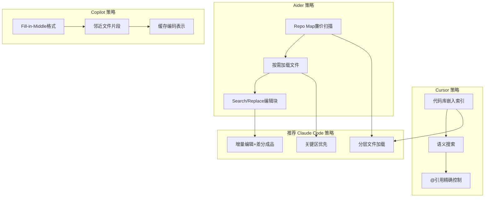
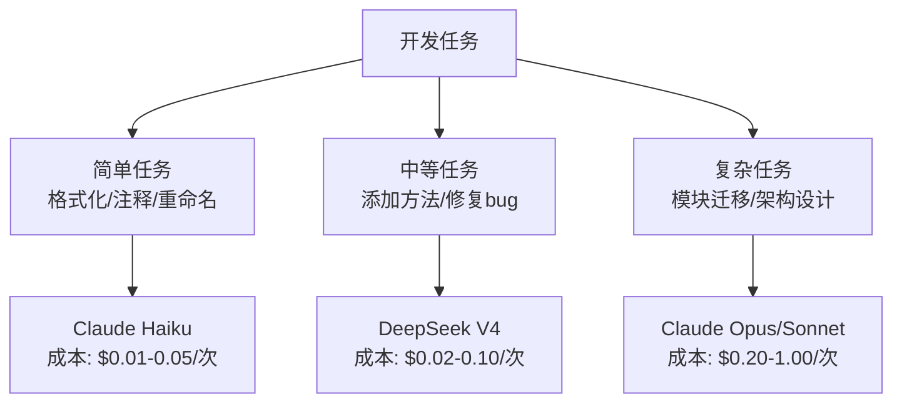

# 工具链与工作流优化：借鉴其他AI编程工具

> Claude Code不是唯一的AI编程工具。Cursor、Copilot、Aider等工具在token优化上各有绝活。借鉴他们的策略，可以显著优化Claude Code的token使用。

---

## 1. 业界工具Token优化策略对比



---

## 2. 各工具核心策略详解

### 2.1 Aider：Repo Map + 按需加载

**核心思路**：先让廉价模型扫描整个仓库生成结构化地图，再让主模型根据地图选择需要的文件。

```
1. 廉价模型扫描 → 生成 Repo Map
   ├── LoginPage.ets (认证)
   ├── HomePage.ets (主页)
   ├── NetworkClient.ets (网络)
   └── DataStore.ets (存储)

2. 用户需求 "实现自动登录"
   → 主模型分析: 需要 LoginPage.ets + DataStore.ets
   → 只加载这2个文件（而不是全部4个）

3. Token节省: 50%(4文件→2文件)
```

**Claude Code中的应用**：
- 不要用 `/init` 扫描整个项目（GitHub Issue #847警告）
- 手动指定需要处理的具体文件和目录
- 使用 `@file` 精确引用，而非模糊描述

### 2.2 Cursor：语义代码索引

**核心思路**：构建代码库向量索引，按语义匹配相关代码。

```
传统方式: Claude Code搜索所有的.ets文件 → 返回全部匹配
Cursor方式: 构建嵌入索引 → 语义搜索 "认证逻辑" → 只返回相关代码

Token节省: 可能有100+文件匹配".ets"，但语义相关只有3-5个
→ 从100+文件减少到3-5个文件 → 节省95%+
```

**Claude Code中的模拟**：
- 使用 `.claudeignore` 排除无关目录
- 创建 `CLAUDE.md` 提供项目结构信息，让Claude更快定位
- 分模块目录，每次只处理一个模块

### 2.3 Copilot：FIM + 邻近上下文

**核心思路**：只发送光标前后的邻近代码，不发送全文件。

```
传统方式: 发送整个文件（5K行）→ 10K+ tokens
Copilot方式: 发送光标前后各50行 → ~200 tokens

Token节省: 98%
```

**Claude Code中的模拟**：
- 用行号范围引用 `@LoginPage.ets:45-89`
- 请求特定函数而非整个文件
- "只修改 `validateForm()` 方法" 而非 "修改LoginPage"

---

## 3. 工作流模式优化

### 3.1 任务分层策略



**实现方式**：在 `.claude/settings.json` 中按场景切换模型。

### 3.2 审查-修改分离模式

借鉴 Aider 的编辑块模式：

```
❌ 传统方式: "重写整个LoginPage.ets" → 输出5K tokens
✅ 分离模式: "审查LoginPage.ets，定位需要修改的地方" → 输出500 tokens
           → "只修改第45-67行" → 输出200 tokens
```

| 模式 | 输入Token | 输出Token | 总Token | 费用(Sonnet) |
|------|:-------:|:-------:|:-----:|:----------:|
| 一次性全量重写 | 15K | 5K | 20K | $0.12 |
| 审查→修改分离 | 10K+10K | 0.5K+0.2K | 20.7K | $0.07 |
| 节省 | | | | **42%** |

### 3.3 批量任务模式

```
❌ 逐个请求:
  "改LoginPage" → "改HomePage" → "改SettingsPage" → ...

✅ 批量请求:
  "以下3个文件各做X修改: @LoginPage.ets @HomePage.ets @SettingsPage.ets"
```

| 模式 | 3个任务的Token消耗 | 费用(Sonnet) |
|------|:---------------:|:----------:|
| 逐个请求(3次) | ~60K total | $0.24 |
| 批量请求(1次) | ~30K total | $0.12 |
| 节省 | | **50%** |

---

## 4. 代码审查Token优化

### 4.1 增量审查 vs 全量审查

```bash
# ❌ 全量审查
"审查整个LoginPage.ets" → 读取全部500行 → 15K tokens

# ✅ 增量审查  
git diff 获取变更 → 只审查变更部分 → 2K tokens
```

### 4.2 审查输出格式

```markdown
审查输出格式要求:
- 问题: [类型] 文件名:行号 — 简短描述
- 严重程度: 🔴/🟡/🔵
- 建议: 一句话修改建议
```

---

## 5. 借鉴其他工具的量化收益

| 策略来源 | 策略 | Claude Code应用 | 预估节省 |
|----------|------|---------------|:------:|
| Aider | Repo Map | 分模块处理 + 精确@引用 | 40-60% |
| Cursor | 语义索引 | .claudeignore + CLAUDE.md结构化 | 30-50% |
| Copilot | 邻近上下文 | 行号引用 + 函数级操作 | 50-70% |
| Aider | 编辑块格式 | 审查-修改分离 | 30-50% |
| 综合 | 任务分层 | 按复杂度选模型 | 60-80% |
| 综合 | 关闭闲置MCP Server | 用啥开啥，不用就关 | 10-20%词汇 |

---

## 6. 关闭闲置工具与MCP Server ⭐ 新发现

**来源**: CSDN + 掘金 社区实测

**问题**: 开发者为了功能丰富安装了各种 MCP Server（网页搜索、研究模式、连接器等），但不用时仍持续占用 Token。

**做法**:
```bash
# 1. 先用 /context 查看谁在消耗Token
/context

# 2. 关掉当前不用的 MCP Server
/mcp remove <server-name>

# 3. 日常禁用不必要的工具权限
# settings.json 中设置 tools 白名单
```

**原则**: **用啥开啥，不用就关。** 
- 不需要联网 → 关网页搜索
- 不需要第三方工具 → 关连接器
- 第一次回答不满意 → 再开扩展思考（平时默认关）

**量化**: 一个闲置的 MCP Server 可额外消耗 2K-5K Token/次。关掉3个 → 省 ~10K/次。

---

## 6. 推荐Claude Code工作流（安卓转鸿蒙）

```yaml
# .claude/settings.json 推荐配置
{
  "model": "claude-3-7-sonnet-20250219",  # 默认
  "extendedThinking": false,
  "autoCompact": true,
  "autoCompactThreshold": 0.75,
  "maxTokens": 4096
}

# 针对不同任务切换的alias
alias cc-review='CLAUDE_CODE_MODEL=claude-3-5-haiku-20241022 claude'  # 审查用便宜模型
alias cc-code='claude'  # 编码用Sonnet
alias cc-arch='CLAUDE_CODE_MODEL=claude-opus-4-20250514 claude'  # 架构用Opus
```

---

*上一篇: [提示工程优化](04-提示工程优化.md) | 下一篇: [量化对比与ROI分析](06-量化对比与ROI分析.md)*
