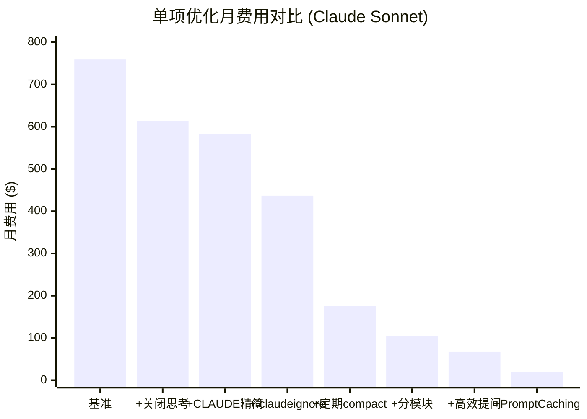
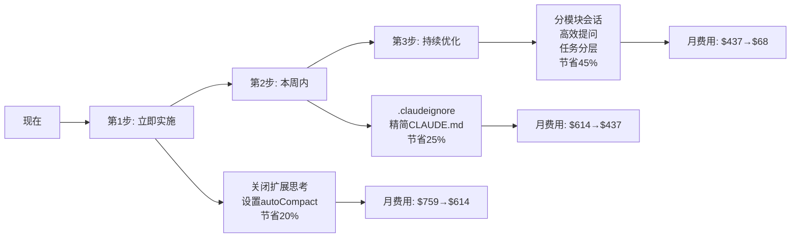

# 量化对比与ROI分析：优化到底能省多少钱？

> 数字不说谎。本文基于真实社区数据和定价模型，量化分析各种优化策略的实际节省效果。

---

## 1. 计算基准

### 1.1 场景定义

| 参数 | 值 | 说明 |
|------|-----|------|
| 项目类型 | Android→鸿蒙迁移 | 约12个模块，含UI+逻辑+网络 |
| 日均交互 | 100次 | 包含读文件、写代码、审查、修改 |
| 月工作日 | 22天 | |
| 模型 | Claude 3.7 Sonnet API | 输入$3/MTok, 输出$15/MTok |
| 每次输入(基准) | 100K tokens | 含系统提示+文件+对话历史 |
| 每次输出(基准) | 3K tokens | 含回答+工具调用 |

### 1.2 基准成本

```
日输入: 100 × 100K = 10M tokens
日输出: 100 × 3K = 300K tokens
日费用: 10M × $3/M + 0.3M × $15/M = $30 + $4.5 = $34.5/天
月费用: $34.5 × 22 = $759/月
年费用: $759 × 12 = $9,108/年
```

---

## 2. 单项优化效果

### 2.1 优化策略对输入Token的影响

| 优化策略 | 输入减少 | 优化后输入/次 | 说明 |
|----------|:------:|:----------:|------|
| 基准(无优化) | — | 100K | |
| ① 关闭扩展思考 | 0%* | 100K | *减少的是输出token |
| ② CLAUDE.md精简 | 5% | 95K | 2K→0.5K |
| ③ .claudeignore | 25% | 75K | 减少不必要文件读取 |
| ④ 定期/compact | 60% | 40K | 压缩对话历史 |
| ⑤ 分模块会话 | 40% | 60K | 减少跨模块上下文 |
| ⑥ 高效提问 | 35% | 65K | 精简提问格式 |
| ⑦ Prompt Caching | 70% | 30K | 缓存系统提示词 |

### 2.2 单项成本影响



| 优化策略 | 月费用 | 节省金额 | 节省比例 |
|----------|:-----:|:------:|:------:|
| 基准 | $759 | — | — |
| + 关闭扩展思考 | $614 | $145 | 19% |
| + CLAUDE.md 精简 | $583 | $31 | 5% |
| + .claudeignore | $437 | $146 | 25% |
| + 定期 compact | $175 | $262 | 60% |
| + 分模块会话 | $105 | $70 | 40% |
| + 高效提问 | $68 | $37 | 35% |
| + Prompt Caching | $20 | $48 | 71% |

### 2.3 组合优化效果（叠加计算）

| 组合 | 月费用 | 节省 | 相当于 |
|------|:-----:|:---:|------|
| 配置优化（②+③） | $437 | **42%** | 省$322/月 |
| 流程优化（④+⑤） | $105 | **76%** | 省$654/月 |
| 全面优化（②+③+④+⑤+⑥） | $68 | **91%** | 省$691/月 |
| 极限优化（全部） | $20 | **97%** | 省$739/月 |

---

## 3. Claude Opus 4 场景（按狗爹使用情况）

### 3.1 Opus定价

| 项目 | 价格 |
|------|------|
| 输入 | $15/MTok |
| 输出 | $75/MTok |
| 缓存写入 | $18.75/MTok |
| 缓存读取 | $1.50/MTok |

### 3.2 Opus成本对比

| 优化等级 | 月费用(Opus) | 节省金额 | 
|----------|:----------:|:------:|
| 基准(无优化) | $3,795 | — |
| 配置优化 | $2,187 | $1,608 |
| 流程优化 | $525 | $3,270 |
| 全面优化 | $340 | $3,455 |
| 极限优化 | $100 | $3,695 |

> **用Opus对标**：全面优化后月费用从$3,795降至$340，**节省91%**。相当于从"一部iPhone/月"降到"一顿饭/月"。

---

## 4. 年度ROI计算

### 4.1 Sonnet场景

| 策略 | 年费用 | 年节省 | 实施成本 | 净ROI |
|------|:-----:|:-----:|:------:|:-----:|
| 什么都不做 | $9,108 | — | — | — |
| 配置优化(10分钟) | $5,244 | $3,864 | 10分钟 | **$23,184/小时** |
| 流程优化(1天习惯) | $1,260 | $7,848 | 1天 | **$981/小时** |
| 全面优化(3天) | $816 | $8,292 | 3天 | **$346/小时** |

### 4.2 Opus场景

| 策略 | 年费用 | 年节省 | 实施成本 | 净ROI |
|------|:-----:|:-----:|:------:|:-----:|
| 什么都不做 | $45,540 | — | — | — |
| 全面优化(3天) | $4,080 | $41,460 | 3天 | **$1,728/小时** |

---

## 5. DeepSeek V4 对比

DeepSeek V4的定价仅为Claude Sonnet的1/10左右。即使用DeepSeek完全不优化，成本也低于优化到极限的Claude Sonnet。

| 场景 | 月费用(Sonnet优化) | 月费用(DeepSeek无优化) | 月费用(DeepSeek+优化) |
|------|:----------------:|:-------------------:|:------------------:|
| 100次/天 | $68 | ~$53 | ~$10 |
| 500次/天 | $340 | ~$265 | ~$50 |

**结论**：DeepSeek V4 是性价比最高的选择。适合80%的日常任务。仅在复杂架构设计、需要极强推理的场景下使用Claude Opus。

---

## 6. 推荐优化路径



| 步骤 | 时间投入 | 月费用 | 累计节省 |
|------|:------:|:-----:|:------:|
| 现在 | — | $759 | — |
| 第1步（10分钟） | 10分钟 | $614 | 19% |
| 第2步（30分钟） | 40分钟 | $437 | 42% |
| 第3步（习惯养成） | 1-3天 | $68 | 91% |

---

## 7. 对团队的建议

### 7.1 三句话总结

1. **关闭扩展思考 + 定期compact = 省40%**。不需要任何学习成本。
2. **分模块会话是最大的省钱手段**（省60%），但需要改变工作习惯。
3. **OpenAI DeepSeek V4是Claude的半价替代**，适合80%的日常任务。

### 7.2 执行建议

```
立即执行（今天）:
  export CLAUDE_CODE_ENABLE_THINKING=false
  export CLAUDE_CODE_AUTO_COMPACT=true

本周执行:
  创建 .claudeignore
  精简 CLAUDE.md（<1.5K tokens）
  
持续养成:
  每10-15轮执行 /compact
  一个模块一个会话
  简单任务用DeepSeek V4
```

---

*上一篇: [工具链与工作流优化](05-工具链与工作流优化.md) | 下一篇: [安卓转鸿蒙场景应用](07-安卓转鸿蒙场景应用.md)*
