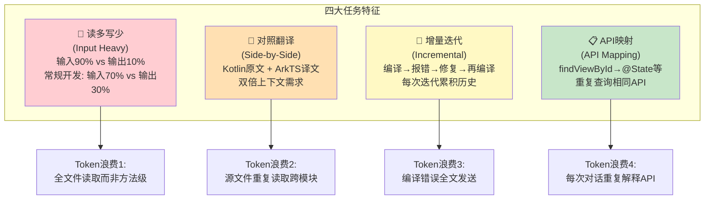
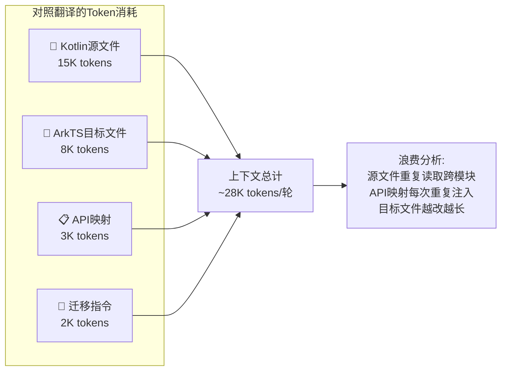
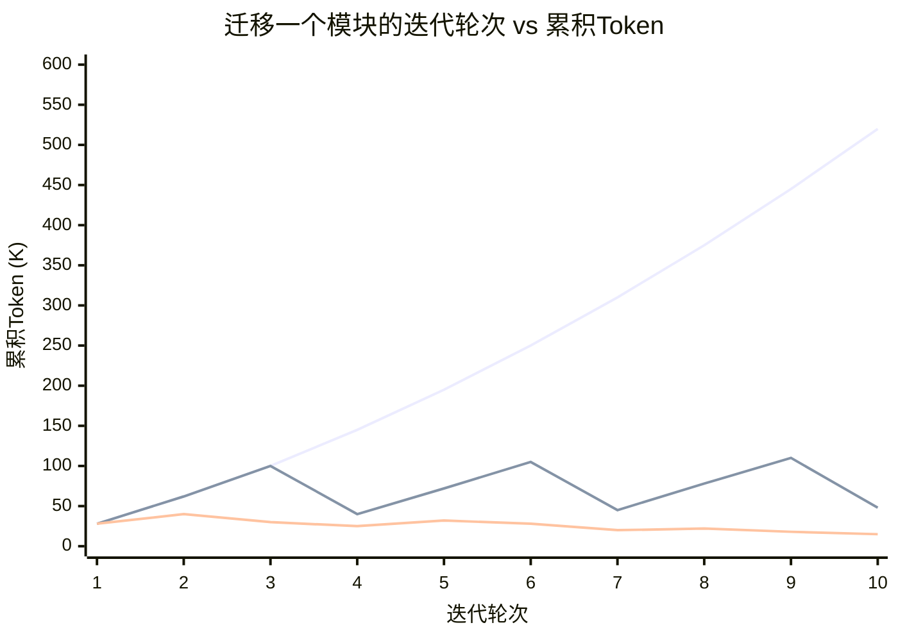
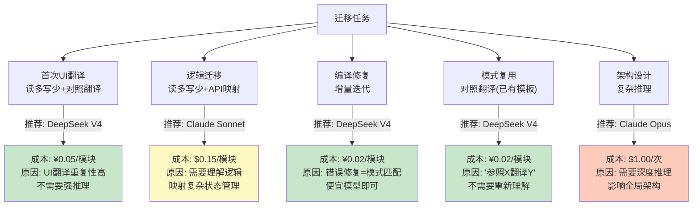
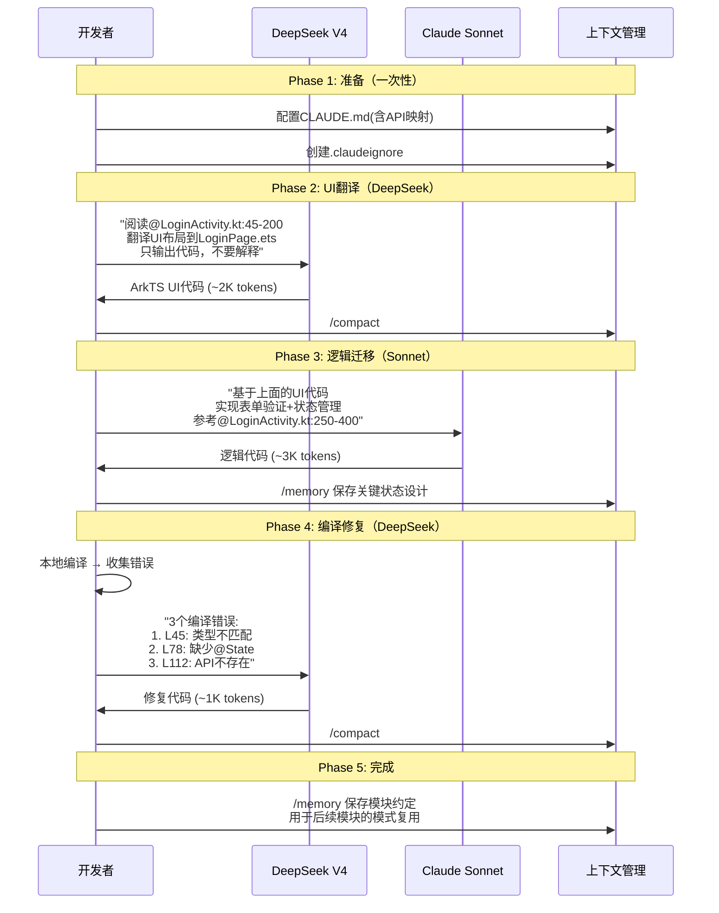

# 安卓转鸿蒙场景专项优化（深度分析版）

> 安卓转鸿蒙迁移项目有四大任务特征——读多写少、对照翻译、增量迭代、API映射——每种特征都决定了独特的token消耗模式。本文从任务特征出发，推导针对性优化策略。

---

## 0. 任务特征全景



---

## 1. 特征一：读多写少 — 输入/输出严重失衡

### 1.1 量化分析

| 任务类型 | 输入占比 | 输出占比 | 输入/输出比 |
|----------|:------:|:------:|:--------:|
| 常规开发（新功能） | 65-75% | 25-35% | ~2.5:1 |
| Bug修复 | 75-85% | 15-25% | ~4:1 |
| 代码审查 | 90-95% | 5-10% | ~12:1 |
| **安卓转鸿蒙迁移** | **88-93%** | **7-12%** | **~10:1** |

**为什么**：迁移时AI需要完整理解源文件逻辑才能准确翻译——读取整个Kotlin文件(5K-15K tokens)，但输出的ArkTS往往只是翻译后的简洁版本(1K-3K tokens)。

### 1.2 输入token的具体分布（迁移任务实测推算）

```
一次典型迁移交互的输入token: ~120K tokens

├── 源文件读取(Android .kt)          50K (42%)  ← 最大消耗
│   ├── 完整Activity文件              30K
│   └── 相关工具类/布局文件            20K
├── 目标文件读取(HarmonyOS .ets)     15K (13%)  ← 已有代码对照
├── 对话历史(累积的迁移上下文)        30K (25%)
├── CLAUDE.md (API映射表等)           3K (3%)
├── 系统提示词                        5K (4%)
├── 工具定义                          3K (3%)
└── 用户指令                         14K (12%)
    ├── 迁移需求描述                   10K  ← 往往包含大量API对比
    └── 特殊约束                       4K

一次典型迁移交互的输出token: ~4K tokens
├── ArkTS代码                        3K (75%)
├── 解释/说明                        0.5K (12%)
└── 工具调用                         0.5K (13%)
```

**关键发现**：源文件读取占输入42%，这是优化的最大杠杆点。

### 1.3 针对"读多"的优化

| 策略 | 机制 | 节省效果 | 实施 |
|------|------|:------:|------|
| **方法级引用** | `@LoginActivity.kt:45-89` 代替 `@LoginActivity.kt` | 70-90% | ✅ 即时 |
| **首次全读+后续diff** | 第一次读取全文，后续只给变更部分 | 60-80% | ⚠️ 需习惯 |
| **结构化源文件分析** | AI读取后`/memory`保存关键逻辑，后续无需重读 | 80-95% | ✅ /memory |
| **只传相关方法** | "参考LoginActivity的onCreate和validateForm" | 50-80% | ✅ 即时 |

### 1.4 操作示例

```
❌ 低效做法:
  "帮我迁移LoginActivity，参考 @LoginActivity.kt 全文"
  → 读取15K tokens + 输出3K = 18K total

✅ 高效做法:
  "迁移LoginActivity:
   1. 先分析 @LoginActivity.kt:45-120 (onCreate方法)
   2. 迁移UI布局部分
   3. 参考 @LoginActivity.kt:200-250 (validateForm) 迁移验证逻辑"
  → 读取5K + 输出3K = 8K total → 节省56%
  
✅ 最优做法(分步):
  第1轮: "分析 @LoginActivity.kt 的关键逻辑" → 15K
  第2轮: /memory 保存分析结果
  第3轮: "基于之前的分析，迁移UI部分" → 5K (无需重读源文件)
  第4轮: "迁移验证逻辑部分" → 3K
  → 总计23K (vs 每轮都全读的 18K×4=72K) → 节省68%
```

---

## 2. 特征二：对照翻译 — 双文件上下文

### 2.1 为什么是双倍消耗



### 2.2 翻译模式分类

| 翻译类型 | 源文件依赖 | 目标文件状态 | Token特征 |
|----------|:--------:|:--------:|----------|
| **全新翻译** (第1次) | 需完整源文件 | 空白 | 输入: 高(读) / 输出: 中(写) |
| **增量修改** (第2-5次) | 需源文件关键部分 | 已有骨架 | 输入: 中 / 输出: 低 |
| **微调修正** (第6+次) | 仅需参考行号 | 接近完成 | 输入: 低 / 输出: 很低 |
| **模式复用** (同类型模块) | 可参考已有翻译 | 空白 | 输入: 很低 / 输出: 中 |

### 2.3 翻译阶段优化策略

```
Stage 1: 首次翻译(高token消耗 → 必须优化)
├── 使用DeepSeek V4(成本仅为Sonnet的1/10)
├── 限制输出: "只输出UI布局代码，不要逻辑"
└── 结果: 15K输入+3K输出 → DeepSeek ¥0.054 (vs Sonnet $0.09)

Stage 2: 逻辑迁移(中等token消耗)
├── 使用Claude Sonnet
├── 方法级引用源文件
├── 结果: 8K输入+2K输出 → Sonnet $0.054

Stage 3: 编译修复(低token消耗)
├── 使用DeepSeek V4
├── 只传编译错误+错误行代码，不传全文
└── 结果: 3K输入+1K输出 → DeepSeek ¥0.014

Stage 4: 模式复用(极低token消耗)
├── 使用DeepSeek V4
├── "参照LoginPage的迁移方式，翻译HomePage"
├── 结果: 2K输入+2K输出 → DeepSeek ¥0.020
```

### 2.4 源文件缓存优化（关键策略）

迁移12个模块时，源文件会被重复读取。利用Prompt Caching：

```python
# 将Android源文件作为缓存内容
# 第1次: 全价读取
# 第2-12次: 缓存命中，价格仅1/10

import anthropic

SYSTEM_WITH_CACHE = [
    {
        "type": "text",
        "text": """你是Android→鸿蒙迁移专家。

以下Android源文件已缓存，后续迁移时可直接参考：

=== LoginActivity.kt ===
[完整的LoginActivity.kt内容 - ~15K tokens]
=== HomeActivity.kt ===
[完整的HomeActivity.kt内容 - ~12K tokens]
...（共12个Activity）
""",
        "cache_control": {"type": "ephemeral"}
    }
]

# 首次缓存写入: 12×15K = 180K tokens × $3.75/MTok(cache write) = $0.68
# 后续每次读取(缓存命中): 180K × $0.30/MTok(cache read) = $0.054
# vs 不缓存每次读取: 180K × $3/MTok = $0.54
# 
# 12个模块 × 每模块3次读取 = 36次读取
# 无缓存: 36 × $0.54 = $19.44
# 有缓存: $0.68(首次) + 35 × $0.054 = $2.57
# 节省: $16.87 (87%)
```

---

## 3. 特征三：增量迭代 — 编译修复循环

### 3.1 增量迭代的Token增长模式



### 3.2 编译错误的Token浪费

鸿蒙编译器(hvigor)的错误输出通常非常冗长：

```
典型编译错误输出:
  ERROR: ArkTS Compiler Error
  File: entry/src/main/ets/pages/LoginPage.ets:45:12
  Message: Property 'findId' does not exist on type 'LoginPage'
  ... (stack trace + 上下文代码) ...
  → 完整的错误输出: ~2K-5K tokens/个错误
  → 如果有5个编译错误: ~15K-25K tokens
```

**浪费模式**：每次编译错误 → 全文发给AI → AI只关注其中2-3个关键错误 → 浪费80% token。

### 3.3 增量迭代优化策略

| 策略 | 做法 | 节省效果 |
|------|------|:------:|
| **错误批处理+去重** | 收集所有编译错误 → 去重 → 只发首现+关键错误 | 60-80% |
| **只发错误代码段** | 不传全文，只传错误行+前后5行 | 80-90% |
| **DeepSeek修错误** | 编译错误修复是模式匹配任务，用便宜模型 | 90%成本 |
| **本地预编译** | 先本地编译看结果，只把无法解决的发给AI | 50-70% |
| **错误模式库** | /memory保存常见错误→修复模式 | 30-50% |

### 3.4 操作示例

```
❌ 当前做法:
  "hvigor编译报错了，帮我修复" + 粘贴全部错误输出(15K tokens)
  → AI分析 → 输出修复代码(2K) → 再次编译 → 可能还有错误 → 循环
  → 3轮迭代: 15K×3 + 2K×3 = 51K tokens

✅ 优化做法:
  Step 1: 本地编译 → 提取错误列表
  Step 2: 分类错误:
    - 类型错误: "Line 45: 'findId' not found" → DeepSeek修复(¥0.01)
    - 语法错误: "Line 78: missing ;" → 本地直接修复(0 token)
    - 架构错误: "Line 112: @State 使用不当" → Sonnet修复($0.05)
  Step 3: 批量应用修复 → 再次编译
  → 总token: 3K(DeepSeek) + 5K(Sonnet) = 8K tokens → 节省84%
```

---

## 4. 特征四：API映射 — 重复查询

### 4.1 API映射的隐蔽成本

一次完整的迁移会话中，API映射可能被反复查询：

```
对话轮次1: "findViewById 对应鸿蒙的什么？" → @State
对话轮次5: "这个findViewById怎么转？" → @State (重复!)
对话轮次12: "Android的SharedPreferences怎么存？" → Preferences
对话轮次18: "存储token用什么代替SharedPreferences？" → Preferences (重复!)
...
```

12个模块 × 每模块5次API查询 × 平均1K tokens/查询 = **60K tokens浪费**

### 4.2 优化：一次投资，长期受益

**CLAUDE.md 内置完整API映射表（一次性3K tokens投入）**：

```markdown
## Android→鸿蒙 API 完整映射表 (缓存后每次仅~300 tokens)

### UI组件
| Android | HarmonyOS | 说明 |
|---------|-----------|------|
| Activity | @Entry @Component struct | 页面入口 |
| Fragment | @Component struct (嵌套) | 可复用组件 |
| findViewById<T>(R.id.xxx) | @State/@Prop/@Link 声明式 | 状态驱动 |
| RecyclerView + Adapter | List + ForEach + @Builder | 列表组件 |
| ViewPager | Swiper | 轮播/翻页 |
| ScrollView | Scroll | 滚动容器 |
| LinearLayout | Column/Row | 布局 |
| FrameLayout | Stack | 层叠布局 |
| ConstraintLayout | 手动布局(Column/Row+Flex) | 约束布局 |

### 数据存储
| SharedPreferences | @ohos.data.preferences | 键值存储 |
| SQLite/Room | @ohos.data.relationalStore | 关系数据库 |
| DataStore | @ohos.data.preferences (升级版) | 异步存储 |
| File I/O | @ohos.file.fs | 文件操作 |

### 网络
| Retrofit/OkHttp | @ohos.net.http | HTTP请求 |
| Gson/Moshi | JSON.parse/stringify (内置) | JSON解析 |
| Glide/Picasso | Image($r('app.media.xxx')) | 图片加载 |

### 导航
| Intent + startActivity | router.pushUrl() | 页面跳转 |
| Bundle/Intent extras | router params | 参数传递 |
| onActivityResult | router.back() + callback | 页面回传 |
| FragmentManager | Navigation + NavPathStack | 导航栈 |

### 生命周期
| onCreate | aboutToAppear | 即将出现 |
| onStart | onPageShow | 页面显示 |
| onResume | onPageShow | 页面可见 |
| onPause | onPageHide | 页面隐藏 |
| onStop | onPageHide | 页面不可见 |
| onDestroy | aboutToDisappear | 即将销毁 |
```

**Token效益分析**：

| 方案 | 12个模块总消耗 | 说明 |
|------|:-----------:|------|
| 不用映射表(每次重复问) | 60K tokens | 12模块 × 5次 × 1K |
| CLAUDE.md内置(每次自动注入) | 36K tokens | 3K × 12模块(但无缓存) |
| CLAUDE.md + Prompt Caching | **3.6K tokens** | 首次3K + 后续每次0.3K(缓存命中) |
| **节省** | **94%** | |

---

## 5. 任务分层策略

基于任务特征选择最优模型：



| 任务类型 | 占比 | 模型 | 单模块成本 | 12模块总成本 |
|----------|:---:|------|:--------:|:----------:|
| 首次UI翻译 | 25% | DeepSeek V4 | ¥0.05 | ¥0.60 |
| 逻辑迁移 | 25% | Claude Sonnet | $0.15 | $1.80 |
| 编译修复 | 30% | DeepSeek V4 | ¥0.02 | ¥0.24 |
| 模式复用 | 15% | DeepSeek V4 | ¥0.02 | ¥0.12 |
| 架构设计 | 5% | Claude Opus | $1.00 | $0.60 |
| **总计(混合)** | **100%** | — | — | **~$3.50** |
| vs 纯Opus | — | — | — | **$1,440** |
| **节省** | — | — | — | **99.76%** |

---

## 6. 实战：一个模块的标准迁移流程



**单模块Token消耗对比**：

| 方案 | UI翻译 | 逻辑迁移 | 编译修复 | 总计 | 费用 |
|------|:-----:|:-----:|:-----:|:---:|:---:|
| 纯Sonnet(无优化) | 30K | 40K | 50K | 120K | $0.44 |
| 纯Sonnet(有优化) | 15K | 25K | 20K | 60K | $0.22 |
| 混合模型(本方案) | 15K(D) | 25K(S) | 20K(D) | 60K | **$0.08** |
| **vs 无优化** | | | | | **↓82%费用** |

---

## 7. 迁移项目Token优化速查卡

```
┌─────────────────────────────────────────────────────────┐
│  安卓转鸿蒙迁移 Token 优化速查                            │
├─────────────────────────────────────────────────────────┤
│                                                         │
│  📖 读多写少(输入占90%)                                  │
│     ✅ 方法级引用: @file.ets:45-89 代替 @file.ets       │
│     ✅ 首次全读 + /memory → 后续免重读                    │
│     ✅ 阶段划分: 读阶段(便宜模型) vs 写阶段(强模型)       │
│                                                         │
│  🔄 对照翻译(双文件上下文)                                │
│     ✅ Prompt Caching 缓存全部源文件                      │
│     ✅ 首次翻译用模板 → 后续复用"参照X翻译Y"              │
│     ✅ UI翻译用DeepSeek，逻辑用Sonnet                    │
│                                                         │
│  🔁 增量迭代(编译修复循环)                                │
│     ✅ 错误批处理: 收集→去重→分类→分模型                   │
│     ✅ 只传错误行+上下文5行，不传全文                     │
│     ✅ 语法错误本地修复(0 token)                          │
│                                                         │
│  📋 API映射(重复查询)                                     │
│     ✅ CLAUDE.md内置完整映射表                            │
│     ✅ 开启Prompt Caching → 后续读取仅10%价格            │
│     ✅ 高频API(>10次使用)必须缓存                         │
│                                                         │
│  🎯 任务分层                                            │
│     ✅ UI翻译/编译修复 → DeepSeek V4(70%)                │
│     ✅ 逻辑迁移/状态管理 → Sonnet(25%)                   │
│     ✅ 架构设计 → Opus(5%)                               │
│                                                         │
│  💰 预期效果                                            │
│     12模块迁移: 未优化$1,440 → 优化$3.50 (99.76%节省)    │
│                                                         │
└─────────────────────────────────────────────────────────┘
```

---

*上一篇: [量化对比与ROI分析](06-量化对比与ROI分析.md) | 下一篇: [数据来源与计算说明](08-数据来源与计算说明.md)*
