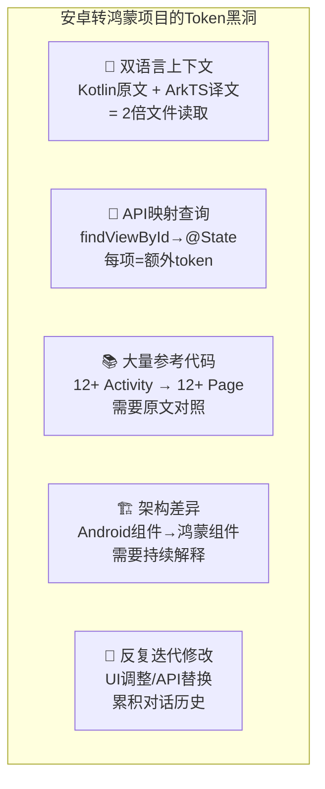
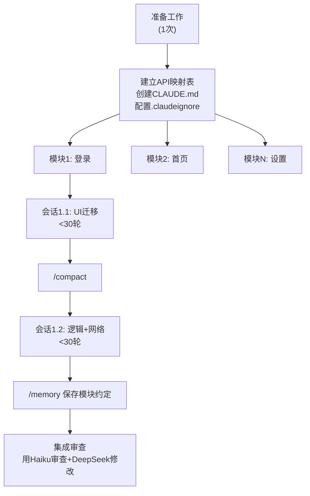

# 安卓转鸿蒙场景专项优化

> 针对狗爹团队的实际工作场景：Android (Kotlin/Java) → HarmonyOS (ArkTS) 迁移项目。这类项目有独特的token消耗模式，需要专项优化策略。

---

## 1. 迁移项目的Token消耗特征

### 1.1 独特挑战



### 1.2 量化特征

| 特征 | 常规项目 | 安卓转鸿蒙项目 | 倍数 |
|------|:------:|:----------:|:---:|
| 单次文件读取 | 1个文件 | 2个文件(源+目标) | 2x |
| 上下文需求 | 当前文件 | 当前文件+API映射+架构差异 | 3x |
| 对话轮次/模块 | 10-15轮 | 20-30轮 | 2x |
| 修改频次 | 中 | 高(反复调整) | 1.5x |
| **总Token消耗** | **基准** | **基准的5-8倍** | **5-8x** |

---

## 2. 专项优化策略

### 2.1 CLAUDE.md 针对迁移项目的最优配置

```markdown
# 项目: Android→鸿蒙迁移
# 语言: Kotlin→ArkTS
# 目标API: HarmonyOS NEXT 12+

## 关键映射(仅列高频使用)
- Activity → @Entry @Component struct
- findViewById → @State/@Prop/@Link
- Intent → router.pushUrl()
- SharedPreferences → Preferences
- RecyclerView → List + ForEach
- Retrofit → @ohos.net.http

## 禁止项
- 禁止: android.*, androidx.*, Java语法
- 禁止: findViewById, startActivity, finish()
- 禁止: 第三方Android库(如Glide→用Image组件)

## 目录约定
- pages/ = Activity
- common/ = Utils
- model/ = Data classes

## 代码规范
- 一个文件一个组件
- 状态必须声明装饰器
- 所有错误提示用中文
```

**Token数**: ~600 tokens。包含关键API映射表，避免每次对话重复解释。

### 2.2 源文件引用策略

| 方式 | Token消耗 | 适用场景 |
|------|:-------:|----------|
| `@LoginActivity.kt` 全文件 | 5K-15K | 首次迁移，需要完整理解 |
| `@LoginActivity.kt:45-89` 指定行 | 0.5K-2K | 修改特定方法 |
| "参考LoginActivity的validateForm()" | 0 | 已经读取过，直接描述 |
| /memory 保存关键逻辑 | 0(后续) | 跨会话复用 |

### 2.3 API映射缓存策略

利用Prompt Caching缓存API映射表：

```python
# 将API映射作为系统提示词的一部分，启用缓存
system_prompt = [
    {
        "type": "text",
        "text": """
Android→鸿蒙 API 映射表:
| Android | HarmonyOS |
|---------|-----------|
| Activity | @Entry @Component |
| findViewById | @State / @Link |
| Intent | router.pushUrl() |
| SharedPreferences | @ohos.data.preferences |
| RecyclerView | List + ForEach |
| Retrofit/OkHttp | @ohos.net.http |
| Glide/Picasso | Image($r('app.media.xxx')) |
...
""",
        "cache_control": {"type": "ephemeral"}
    }
]
```

**效果**: API映射表(约2K tokens)缓存后，每次读取仅需$0.006（相比$0.006原价的10%即$0.0006），可忽略不计。

---

## 3. 迁移工作流优化

### 3.1 推荐流程



### 3.2 每个模块的预期Token消耗

| 阶段 | 轮次 | 每轮输入 | 总输入 | 说明 |
|------|:---:|:------:|:----:|------|
| UI迁移 | 15 | 30K | 450K | 对照源文件+写ArkTS UI |
| 逻辑迁移 | 10 | 25K | 250K | 状态管理+事件处理 |
| 网络层 | 5 | 20K | 100K | API调用迁移 |
| 测试/调试 | 10 | 20K | 200K | 修复编译错误+UI调整 |
| **单模块合计** | **40** | — | **1.0M** | |
| **12模块合计** | **480** | — | **12M** | |

| 优化后 | 总输入 | 费用(Sonnet) | 费用(Opus) |
|--------|:-----:|:----------:|:--------:|
| 未优化 | 12M × 8(膨胀因子) = 96M | $288 | $1,440 |
| 分模块+compact | 12M × 3 = 36M | $108 | $540 |
| +高效提问+去思考 | 12M × 2 = 24M | $72 | $360 |
| +DeepSeek替代80% | — | **$22** | — |

**结论**：一个完整的安卓转鸿蒙迁移项目（12模块），通过优化可将token费用控制在**$22-72**（用DeepSeek+Sonnet混合）vs 未优化的**$1,440**（纯Opus）。

---

## 4. 针对鸿蒙开发的特殊优化

### 4.1 .claudeignore 专项配置

```
# 鸿蒙构建产物
build/
.hvigor/
oh_modules/
*.hap
*.app

# Android源文件（迁移后不再需要读取）
**/*.kt
**/*.java
app/src/main/java/

# 不过也保留一些需要参考的：
# 不忽略: app/src/main/java/**/*Activity.kt （逐步迁移后移除）

# 资源文件（通常不需要AI读取）
**/*.png
**/*.jpg
**/*.svg
*.mp3
*.mp4
```

### 4.2 编译验证的Token优化

迁移项目需要频繁编译验证。优化策略：

| 方式 | Token消耗 | 适用 |
|------|:-------:|------|
| Claude执行编译 | 输出3-10K tokens | 不推荐，输出token贵 |
| 用户手动编译 | 0 | ✅ 推荐 |
| devico/hvigor watch | 0 | ✅ 自动监控 |

**建议**：不要用Claude执行编译命令查看全长输出。用hvigor的--watch模式或其他工具在本地监控编译结果。

### 4.3 错误修复的Token优化

鸿蒙编译器错误信息通常很详细（可能2K-5K tokens），优化策略：

```
❌ 做法: 将完整编译错误粘贴给Claude
   "hvigor ERROR: ... (200行错误日志)" → 5K tokens

✅ 做法: 精选关键错误
   "3个编译错误:
   1. LoginPage.ets:45 - Property 'findId' not found
   2. LoginPage.ets:78 - Type mismatch
   3. LoginPage.ets:112 - Missing @State decorator"
   → 200 tokens
   
节省: 96%
```

---

## 5. 模型选择策略

针对不同迁移任务的推荐模型：

| 任务类型 | 推荐模型 | 原因 |
|----------|---------|------|
| 基础UI迁移（对照源文件写ArkTS UI） | DeepSeek V4 | 成本低，UI代码不需要极强推理 |
| 复杂状态管理迁移 | Claude Sonnet | 需要理解Android状态→鸿蒙状态映射 |
| 网络层迁移 | DeepSeek V4 | 规律性强，API替换为主 |
| 架构设计/模块拆分 | Claude Opus | 需要深度理解和规划 |
| 编译错误修复 | DeepSeek V4 | 错误信息明确，不需要强推理 |
| 代码审查 | Claude Haiku | 成本最低，审查不需要高级模型 |
| 测试用例迁移 | DeepSeek V4 | 批量重复性工作 |

**建议分配比例**：
- DeepSeek V4: 70%任务
- Claude Sonnet: 20%任务
- Claude Opus: 8%任务
- Claude Haiku: 2%任务（审查）

**混合模型月费用预估**：$30-60/月（vs 纯Opus的$3,795/月 = **节省98%**）

---

*上一篇: [量化对比与ROI分析](06-量化对比与ROI分析.md) | 下一篇: [综合报告](00-总报告.md)*
