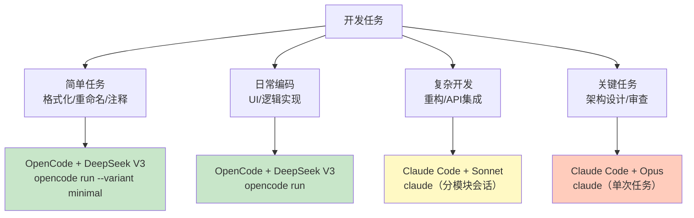

# OpenCode Token 优化指南

> OpenCode 是一个**提供商无关**的开源AI编程Agent（CLI + TUI），支持 Anthropic/OpenRouter/OpenAI 等多种后端。
> 它的token优化与Claude Code有相似之处，但因"提供商无关"的架构而有独特策略。

---

## 1. OpenCode 与 Claude Code 的关键差异

| 维度 | Claude Code | OpenCode |
|------|-----------|----------|
| 后端着 | 仅Anthropic (Claude) | 多提供商: Anthropic, OpenRouter, OpenAI 等 |
| 模型选择 | `/model` 命令切换Claude模型 | `--model` 可切换到任意提供商的任意模型 |
| 用量统计 | `/tokens`, `~/.claude/usage.json` | `opencode stats`, `opencode stats --days 7` |
| 会话管理 | `/compact`, `/memory`, `/clear` | `opencode session list`, `opencode -s <id>` |
| 配置方式 | `~/.claude/settings.json` | 环境变量 + `opencode auth login` |
| 系统要求 | macOS 11+ | **macOS 12+**（⚠️ Big Sur不支持） |
| 价格 | 固定(Claude定价) | 取决于选择的提供商和模型 |
| 上下文文件 | `CLAUDE.md`, `.claudeignore` | 无直接的`.md`注入机制，用 `-f` 指定文件 |

---

## 2. OpenCode 独有的Token优化策略

### 2.1 提供商套利（最大优势）

OpenCode最强大的省钱能力在于**可以选择最便宜的提供商**执行同一任务：

```bash
# 日常编码 → 用DeepSeek (通过OpenRouter)
opencode run 'Add form validation to LoginPage' --model openrouter/deepseek/deepseek-chat

# 代码审查 → 用Claude Haiku (通过Anthropic)
opencode run 'Review this code' -f LoginPage.ets --model anthropic/claude-3-5-haiku-20241022

# 复杂架构 → 用Claude Sonnet/Opus
opencode run 'Design migration strategy' --model anthropic/claude-sonnet-4-20250514
```

| 提供商/模型 | 输入价 | 输出价 | 适合任务 |
|------------|:-----:|:-----:|---------|
| OpenRouter → DeepSeek V3 | ~$0.27/MTok | ~$1.10/MTok | 日常编码 |
| OpenRouter → Claude Haiku | ~$0.80/MTok | ~$4/MTok | 代码审查 |
| Anthropic → Claude Sonnet | $3/MTok | $15/MTok | 复杂开发 |
| Anthropic → Claude Opus | $15/MTok | $75/MTok | 架构设计 |

### 2.2 推理力度控制

OpenCode的`--variant`参数可控制推理深度：

```bash
# 最小推理 → 最低token消耗
opencode run 'Rename variables' --variant minimal

# 标准推理 → 默认
opencode run 'Refactor auth module'

# 最大推理 → 最高token消耗（类似Claude扩展思考）
opencode run 'Debug complex race condition' --variant max --thinking
```

| 推理力度 | 输出Token增幅 | 适用场景 |
|:------:|:----------:|---------|
| minimal | -40% vs 默认 | 格式化、重命名、简单修改 |
| 默认 | 基准 | 常规开发 |
| high | +30-50% | 需要仔细思考的任务 |
| max + thinking | +100-200% | 复杂调试、架构设计 |

### 2.3 Session管理（替代/compact）

OpenCode没有`/compact`命令，但提供了Session管理机制：

```bash
# 查看历史Session
opencode session list

# 继续之前的Session（累积上下文）
opencode -c                      # 继续最近Session
opencode -s ses_abc123           # 继续指定Session

# 开新Session（清空上下文 → 等同于 /clear）
opencode                         # 默认新Session
opencode --title "Login模块迁移"  # 命名Session
```

**Token优化策略**：
- ✅ 一个模块一个Session → 等同于分模块会话
- ✅ 完成模块后开启新Session → 等同于/clear
- ❌ 长时间在同一Session中工作 → 累积上下文膨胀

### 2.4 一次性任务 vs 交互式会话

```bash
# 一次性任务（省token，无需维护上下文）
opencode run 'Fix all TypeScript errors in this file' -f broken.ets
# → 读取文件 → 修改 → 返回结果 → 退出
# Token消耗: 仅本次交互

# 交互式会话（多轮，累积上下文）
opencode
# → TUI模式，多轮对话
# Token消耗: 累积增长
```

**建议**：能用`opencode run`搞定的就不要进TUI。

---

## 3. OpenCode 配置优化

### 3.1 环境变量设置

```bash
# 设置默认模型（选便宜的）
export OPENCODE_DEFAULT_MODEL="openrouter/deepseek/deepseek-chat"

# 设置OpenRouter API Key（省去每个提供商的单独配置）
export OPENROUTER_API_KEY="sk-or-v1-xxx"

# 设置Anthropic API Key（用于重要任务）
export ANTHROPIC_API_KEY="sk-ant-xxx"
```

### 3.2 Auth管理

```bash
# 添加提供商
opencode auth login    # 交互式添加

# 查看已配置的提供商
opencode auth list

# 输出示例:
# anthropic ✓ (Claude Sonnet, Claude Haiku, Claude Opus)
# openrouter ✓ (100+ models available)
```

### 3.3 用量监控

```bash
# 查看总体用量
opencode stats

# 查看最近7天，按模型分
opencode stats --days 7 --models

# 输出示例:
# Model                           Sessions  Input Tokens  Output Tokens  Est. Cost
# openrouter/deepseek/deepseek    45        2,340,000     89,000         $0.75
# anthropic/claude-sonnet-4       12        890,000       34,000         $3.18
# anthropic/claude-opus-4          2        120,000       8,000          $2.40
# ─────────────────────────────────────────────────────────────────────────────
# Total                           59        3,350,000     131,000        $6.33
```

---

## 4. 文件上下文控制

### 4.1 精确指定文件（减少不必要读取）

```bash
# ❌ 不指定文件 → OpenCode可能扫描整个项目
opencode run 'Fix the login bug'

# ✅ 精确指定需要的文件
opencode run 'Fix the login bug' -f pages/LoginPage.ets -f common/AuthService.ets
```

### 4.2 .gitignore 也是 .opencodeignore

OpenCode会自动遵循`.gitignore`，所以：

```gitignore
# 这些目录和文件不会被OpenCode读取
build/
node_modules/
oh_modules/
*.hap
*.app
.hvigor/
```

---

## 5. 与Claude Code的混合使用策略



**分工建议**：

| 工具 | 负责比例 | 模型 | 月费用预估 |
|------|:------:|------|:--------:|
| OpenCode | 60% | DeepSeek V3 | ~$15 |
| Claude Code | 25% | Sonnet | ~$18 |
| Claude Code | 10% | Opus | ~$20 |
| OpenCode | 5% | Claude Haiku | ~$2 |
| **总计** | **100%** | | **~$55/月** |

---

## 6. OpenCode vs Claude Code Token优化速查

| 优化策略 | Claude Code | OpenCode |
|----------|-----------|----------|
| 关闭扩展思考 | `ENABLE_THINKING=false` | `--variant minimal` |
| 模型切换 | `/model` | `--model provider/model` |
| 提供商套利 | 不支持 | ✅ 核心优势 |
| 自动压缩 | `AUTO_COMPACT=true` | 开新Session替代 |
| 对话压缩 | `/compact` 命令 | 开新Session |
| 文件过滤 | `.claudeignore` | `.gitignore` |
| 用记忆 | `/memory` | Session命名+继续 |
| 用量查看 | `/tokens` | `opencode stats` |
| 系统提示精简 | `CLAUDE.md` | 无对应机制 |

---

## 7. OpenCode 快速启动清单

```bash
# 1. 安装
npm i -g opencode-ai@latest

# 2. 添加提供商
opencode auth login    # 添加 DeepSeek (OpenRouter) + Anthropic

# 3. 设置默认模型为便宜选项
export OPENCODE_DEFAULT_MODEL="openrouter/deepseek/deepseek-chat"

# 4. 日常使用
# 简单任务
opencode run '任务描述' -f 相关文件.ets --variant minimal

# 重要任务  
opencode run '架构设计' -f 关键文件.ets --model anthropic/claude-sonnet-4

# 5. 监控用量
opencode stats --days 7

# 6. 查看单次会话成本
opencode stats --models
```

---

## 8. OpenCode 的局限性

| 局限 | 影响 | 缓解方案 |
|------|------|---------|
| macOS 12+ 要求 | Big Sur无法使用 | 用Claude Code替代 |
| 无CLAUDE.md机制 | 每次需手动指定项目约定 | 在提示词中附上项目规则 |
| 无Prompt Caching | 系统提示词每次重新发送 | 开新Session而非长会话 |
| 用量统计不够细 | 无法区分单文件token | 用OpenRouter dashboard补充 |

---

*上一篇: [数据来源与计算说明](08-数据来源与计算说明.md)*
