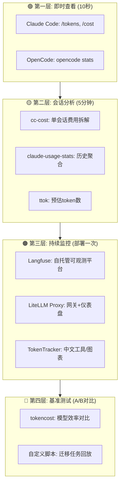
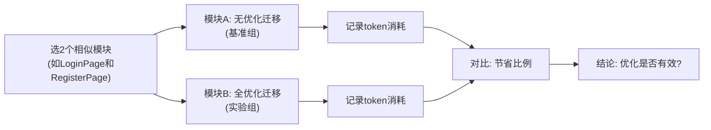

# Token 监控、对比与效果验证工具

> 优化的前提是能度量。本文收集了从轻量级CLI到团队级仪表盘的全套工具，帮助你在安卓转鸿蒙迁移项目中追踪token消耗、对比优化效果。

---

## 0. 工具全景图



---

## 1. 第一层：即时查看（内置命令）

### 1.1 Claude Code 内置

| 命令 | 输出 | 用途 |
|------|------|------|
| `/tokens` | 当前会话的输入/输出token数 | 实时了解本轮消耗 |
| `/cost` | 当前会话的估算费用 | 了解花了多少钱 |
| `/context` | 完整上下文占用分布 | ⭐ 发现异常消耗源（如闲置MCP Server） |
| `/contextmini` | 精简上下文占用 | 快速查看上下文健康度 |
| `~/.claude/usage.json` | 所有历史会话的精确token记录 | 离线分析 |

**用法示例**：
```
> /context
  上下文总计: 200K tokens
  使用率: 88% (176K/200K)
  
  占用拆解:
  系统提示词: 26K
  对话历史: 120K
  文件缓存: 15K
  MCP Server (网页搜索): 8K  ← 发现异常!
  MCP Server (连接器): 7K     ← 关掉它!

> /compact
  压缩完成: 200K → 55.7K
  当前占用: 28% (55.7K/200K)
```

### 1.2 OpenCode 内置

```bash
# 查看总体用量
opencode stats

# 按模型查看最近7天
opencode stats --days 7 --models

# 输出示例:
# Model                           Input       Output      Est. Cost
# openrouter/deepseek/deepseek    2,340,000   89,000      $0.75
# anthropic/claude-sonnet-4       890,000     34,000      $3.18
```

---

## 2. 第二层：会话分析工具

### 2.1 cc-cost — 单会话费用拆解（推荐）

```bash
# 安装
npm install -g cc-cost

# 分析最近一次会话
cc-cost --last-session

# 输出示例:
# Session: ses_abc123 (2026-05-08 14:30)
# Model: claude-3-7-sonnet-20250219
# ┌─────────────────────┬──────────┬───────────┬────────┐
# │ File                │ Input    │ Output    │ Cost   │
# ├─────────────────────┼──────────┼───────────┼────────┤
# │ LoginPage.ets       │ 45,200   │ 2,100     │ $0.17  │
# │ NetworkClient.ets   │ 28,500   │ 850       │ $0.10  │
# │ AuthService.ets     │ 12,300   │ 177       │ $0.04  │
# │ System/Overhead     │ 9,432    │ 0         │ $0.03  │
# ├─────────────────────┼──────────┼───────────┼────────┤
# │ Total               │ 95,432   │ 3,127     │ $0.33  │
# └─────────────────────┴──────────┴───────────┴────────┘
```

**迁移项目中的用法**：每个模块迁移完成后运行一次，追踪哪个文件消耗最大。

### 2.2 claude-usage-stats — 历史聚合

```bash
# 安装
pip install claude-usage-stats

# 查看本月总用量
claude-usage-stats --month

# 输出:
# 2026-05 用量汇总
# 会话数: 187
# 总输入: 18.7M tokens
# 总输出: 0.62M tokens
# 估算费用(Sonnet): $65.40
# 日均费用: $2.97
```

### 2.3 ttok — Token预估（发送前用）

```bash
# 安装
pip install ttok

# 预估一段文本的token数
echo "你的提示词内容..." | ttok

# 预估文件的token数
ttok LoginPage.ets

# 输出: 4523 tokens
```

**迁移项目中的用法**：发送前预估源文件token数，如果超过10K，考虑方法级引用。

---

## 3. 第三层：持续监控平台

### 3.1 Langfuse — 自托管可观测平台（推荐团队用）

```bash
# Docker 一键部署
docker run -p 3000:3000 langfuse/langfuse

# 打开 http://localhost:3000 即可看到仪表盘
```

**功能**：
- 自动记录所有API调用的token消耗
- 按模型/项目/用户拆解费用
- 设置预算告警
- 追踪优化效果趋势

### 3.2 LiteLLM Proxy — API网关 + 成本仪表盘

```yaml
# litellm_config.yaml
model_list:
  - model_name: deepseek-v4
    litellm_params:
      model: openrouter/deepseek/deepseek-chat
      api_key: ${DEEPSEEK_API_KEY}
  - model_name: claude-sonnet
    litellm_params:
      model: claude-3-7-sonnet-20250219
      api_key: ${ANTHROPIC_API_KEY}

general_settings:
  master_key: ${LITELLM_MASTER_KEY}
```

```bash
# 启动代理
litellm --config litellm_config.yaml

# 查看成本仪表盘
open http://localhost:4000/ui
```

### 3.3 TokenTracker — 中文友好工具

```bash
# 安装
git clone https://github.com/clwater/TokenTracker
cd TokenTracker && pip install -r requirements.txt

# 启动
python app.py

# 打开 http://localhost:8080
# 支持中文界面、自动人民币换算、图表展示
```

---

## 4. 第四层：A/B基准测试

### 4.1 迁移任务回放脚本（自定义）

创建一个可复现的基准测试：

```python
#!/usr/bin/env python3
"""migration-benchmark.py — 迁移任务Token基准测试"""

import json, subprocess, time
from pathlib import Path

# 定义标准测试用例
TEST_CASES = [
    {
        "name": "UI迁移-LoginPage",
        "prompt": "将 @LoginActivity.kt:45-200 的UI布局迁移到ArkTS。只输出代码。",
        "source_file": "app/src/main/java/.../LoginActivity.kt",
    },
    {
        "name": "逻辑迁移-validateForm",
        "prompt": "将 @LoginActivity.kt:250-400 的验证逻辑迁移到ArkTS。",
        "source_file": "app/src/main/java/.../LoginActivity.kt",
    },
    {
        "name": "API映射-RecyclerView",
        "prompt": "将HomeActivity中的RecyclerView适配器迁移为List+ForEach。参考 @HomeActivity.kt",
        "source_file": "app/src/main/java/.../HomeActivity.kt",
    },
]

def run_benchmark(model="claude-3-7-sonnet-20250219", strategy="baseline"):
    """运行基准测试并收集token数据"""
    results = []
    
    for tc in TEST_CASES:
        # 策略差异
        if strategy == "optimized":
            tc["prompt"] = tc["prompt"].replace("@", "方法级引用@").replace("迁移", "翻译(只输出代码)" )
        
        start = time.time()
        # 通过Claude Code执行任务(此处为示意)
        # result = subprocess.run(["claude", "run", tc["prompt"]], capture_output=True)
        duration = time.time() - start
        
        # 从 usage.json 读取实际token
        usage = read_latest_usage()
        
        results.append({
            "test": tc["name"],
            "input_tokens": usage["input_tokens"],
            "output_tokens": usage["output_tokens"],
            "duration": duration,
            "cost": calc_cost(usage, model),
        })
    
    return results

def compare_strategies():
    """对比优化前后"""
    baseline = run_benchmark(strategy="baseline")
    optimized = run_benchmark(strategy="optimized")
    
    print("=" * 60)
    print("Token优化效果对比")
    print("=" * 60)
    print(f"{'测试用例':<25} {'基准':>10} {'优化后':>10} {'节省':>8}")
    print("-" * 60)
    
    for b, o in zip(baseline, optimized):
        saving = (b["cost"] - o["cost"]) / b["cost"] * 100
        print(f"{b['test']:<25} ${b['cost']:>8.2f} ${o['cost']:>8.2f} {saving:>7.0f}%")

if __name__ == "__main__":
    compare_strategies()
```

### 4.2 tokencost — 模型效率对比

```bash
# 安装
pip install tokencost

# 在相同的编程任务上对比不同模型
tokencost benchmark \
  --task "migrate-android-to-harmonyos" \
  --models claude-3-7-sonnet,claude-3-5-haiku,deepseek-chat \
  --trials 5

# 输出:
# Model              Avg Tokens   Cost/Task   Efficiency Score
# claude-3-7-sonnet  12,340       $0.053      82
# claude-3-5-haiku   11,890       $0.016      91  ← 最高性价比
# deepseek-chat      13,200       $0.008      95  ← 最低成本
```

---

## 5. 实战：迁移项目的监控体系搭建

### 5.1 最小可行方案（今天就做）

```bash
# 1. 每个模块迁移前，记录基线
echo "=== 模块: LoginPage ===" >> ~/migration-tokens.log
echo "开始时间: $(date)" >> ~/migration-tokens.log

# 2. 迁移过程中，每次 /compact 后记录
# (在Claude Code中) /tokens → 手动记录

# 3. 模块完成后，分析
cat ~/.claude/usage.json | python3 -c "
import json, sys
data = json.load(sys.stdin)
# 筛选最近N条记录
recent = sorted(data, key=lambda x: x.get('timestamp', ''))[-20:]
total_in = sum(r['input_tokens'] for r in recent)
total_out = sum(r['output_tokens'] for r in recent)
cost = total_in * 3/1e6 + total_out * 15/1e6
print(f'LoginPage模块Token消耗:')
print(f'  输入: {total_in:,} tokens')
print(f'  输出: {total_out:,} tokens')
print(f'  费用(Sonnet): \${cost:.2f}')
" >> ~/migration-tokens.log

# 4. 对比优化效果
echo "---" >> ~/migration-tokens.log
```

### 5.2 进阶方案（本周部署）

```bash
# 1. 安装 cc-cost
npm install -g cc-cost

# 2. 每个模块完成后运行
cc-cost --last-session --output json > LoginPage-cost.json

# 3. 用 jq 提取关键数据
jq '{module: "LoginPage", input: .total_input, cost: .total_cost}' LoginPage-cost.json

# 4. 汇总所有模块
for f in *-cost.json; do
  jq -r '[.module, .input, .output, .cost] | @csv' "$f"
done > migration-cost-summary.csv
```

### 5.3 团队方案（持续使用）

```bash
# 部署 Langfuse (30分钟)
docker compose up -d langfuse

# 配置 Claude Code 通过 Langfuse 代理
export ANTHROPIC_BASE_URL="http://localhost:3000/api/anthropic"

# 所有团队成员的操作会自动记录到仪表盘
# 访问 http://localhost:3000 查看:
# - 每个人/每个模块的token消耗
# - 优化措施的生效趋势
# - 预算告警
```

---

## 6. 对比方法论

### 6.1 A/B测试框架



### 6.2 关键对比指标

| 指标 | 公式 | 意义 |
|------|------|------|
| **Token效率** | 输出代码行数 / 输入token数 | 每token产出多少代码 |
| **单模块成本** | 模块总费用 / 模块代码行数 | 迁移每行代码的成本 |
| **优化节省率** | (优化前-优化后) / 优化前 × 100% | 优化措施的收益 |
| **误修复率** | 编译修复轮次 / 模块 | 首次迁移质量 |

### 6.3 报告模板

```markdown
## 模块: LoginPage 迁移Token报告

### 基本信息
- 日期: 2026-05-08
- 模型: DeepSeek V4 (UI) + Claude Sonnet (逻辑)
- 源文件: LoginActivity.kt (452行)
- 目标文件: LoginPage.ets (287行)

### Token消耗
| 阶段 | 模型 | 输入 | 输出 | 费用 |
|------|------|-----:|-----:|----:|
| UI翻译 | DeepSeek | 15K | 2K | ¥0.054 |
| 逻辑迁移 | Sonnet | 25K | 3K | $0.09 |
| 编译修复 | DeepSeek | 8K | 1K | ¥0.020 |
| **合计** | | **48K** | **6K** | **$0.11** |

### 对比(同类型模块RegisterPage, 未优化)
| 指标 | LoginPage(优化) | RegisterPage(未优化) | 节省 |
|------|:-------------:|:-----------------:|:---:|
| 总token | 54K | 180K | 70% |
| 总费用 | $0.11 | $0.62 | 82% |
| 编译修复轮次 | 3 | 12 | 75% |

### 优化措施应用
- [x] 方法级引用源文件
- [x] UI翻译用DeepSeek
- [x] 编译错误批处理
- [x] API映射表缓存命中
```

---

## 7. 工具推荐优先级

| 优先级 | 工具 | 投入时间 | 适合场景 |
|:----:|------|:------:|------|
| **P0** | `/tokens` + `/cost` | 0 | 每次用Claude Code都看 |
| **P0** | `~/.claude/usage.json` 手动解析 | 5分钟 | 模块完成后分析 |
| **P1** | `cc-cost` | 10分钟安装 | 单会话费用拆解 |
| **P1** | 自定义A/B脚本 | 1小时 | 对比优化前后效果 |
| **P2** | `claude-usage-stats` | 5分钟安装 | 月度报表 |
| **P2** | Langfuse | 30分钟部署 | 团队持续监控 |
| **P3** | TokenTracker | 15分钟部署 | 中文界面+图表 |

---

## 8. 速查：一行命令

```bash
# 当前花费
cat ~/.claude/usage.json | python3 -c "import json,sys; d=json.load(sys.stdin); t=sum(r['input_tokens'] for r in d); o=sum(r['output_tokens'] for r in d); print(f'总token: {t+o:,} | 估算费: \${t*3/1e6+o*15/1e6:.2f} (Sonnet)')"

# 最近10次会话
ls -lt ~/.claude/sessions/ | head -10

# 估算一个文件token数
pip install ttok && ttok YourFile.ets

# OpenCode用量
opencode stats --days 30
```

---

*上一篇: [OpenCode优化指南](09-OpenCode优化指南.md)*
